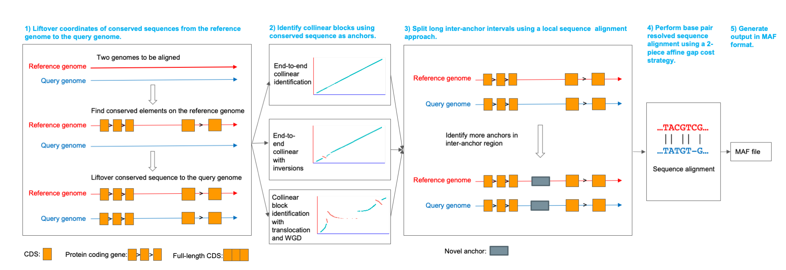

# AnchorWave &middot; [![license][license-badge]][license] [](http://bioconda.github.io/recipes/anchorwave/README.html)
<p align="center">
</p>

## Description
AnchorWave (Anchored Wavefront Alignment) identifies collinear regions via conserved anchors (full-length CDS and full-length exon have been implemented currently) and breaks collinear regions into shorter fragments, i.e., anchor and inter-anchor intervals. 
By performing sensitive sequence alignment for each shorter interval via a 2-piece affine gap cost strategy and merging them together, AnchorWave generates a whole-genome alignment for each collinear block. AnchorWave implements commands to guide collinear block identification with or without chromosomal rearrangements and provides options to use known polyploidy levels or whole-genome duplications to inform alignment.
## Principle of the AnchorWave process
<p align="center">

</p>

AnchorWave takes the reference genome sequence and gene annotation in GFF3 format as input and extracts reference full-length coding sequences (CDS) to use as anchors. 
Using a splice aware alignment program (minimap2 and GMAP have been tested) to lift over the start and end position of reference full-length CDS to the query genome (step 1). 
AnchorWave then identifies collinear anchors using one of three user-specified algorithm options (step 2) and uses the [WFA](https://github.com/smarco/WFA) algorithm to perform alignment for each anchor and inter anchor interval (step 4). Some anchor/inter-anchor regions cannot be aligned using our standard approach due to high memory and computational time costs. For these, AnchorWave either identifies novel anchors within long inter-anchor regions (step 3), or for those that cannot be split by novel anchors, aligns using the ksw_extd2 function implemented in minimap2 or a reimplemented sliding window approach (step 4). AnchorWave concatenates base pair sequence alignment for each anchor and inter-anchor region and outputs the alignment in MAF format (step 5).


Table of Contents
=================
1. [Installation](#Installation)
    1. [Installation from source code](#Installation-from-source-code)
       1. [Dependencies](#Dependencies)
       2. [Compile](#Compile)
    2. [Installation using conda](#Installation-using-conda)
    3. [Installation using Docker](#Installation-using-Docker)
2. [Usage](#Usage)
    1. [Lift over the reference CDS coordinates to the query genome](#lift-over-the-reference-cds-coordinates-to-the-query-genome-command-1-3)
    2. [Genome alignment without chromosomal rearrangement](#genome-alignment-without-chromosomal-rearrangement-an-option-of-command-4)
    3. [Genome alignment without translocation rearrangement while with inversions](#genome-alignment-without-translocation-rearrangement-while-with-inversions-an-option-of-command-4)
    4. [Genome alignment with relocation variation, chromosome fusion or whole genome duplication](#genome-alignment-with-relocation-variation-chromosome-fusion-or-whole-genome-duplication-an-option-of-command-4)
3. [Tips for following analysis](#tips-for-following-analysis)
4. [Guidelines](#walkthrough-guidelines)
5. [FAQ](#FAQ)
6. [Contact](#Contact)
7. [Founding](#Founding)
8. [Citation](#Citation)
## Installation
### Installation from source code
#### Dependencies
GNU GCC >=7.0  
Cmake >= 3.0  
[minimap2](https://github.com/lh3/minimap2) or [GMAP](http://research-pub.gene.com/gmap/)  
Operating System: Linux or MAC  
Memory: > 20 Gb  
 
If you would like to take the advantage of modern CPU to speed up please refer [the document for advanced installation](./installation.md).  
If you are working on a machine with ARM CPU, for example a MAC machine with M1/M2 CPU, please also refer [the document for advanced installation](./installation.md).  
If you are using old x86_64 CPUs without SSE4.1 but with SSE2, please also refer [the document for advanced installation](./installation.md).

#### Compile
```
git clone https://github.com/baoxingsong/anchorwave.git
cd anchorwave
cmake ./
make
```
You will get an executable file named ```anchorwave ```.
The code has been tested under Ubuntu 20.2 and CentOS 7 with intel/AMD CPU. It should work well on other REDHAT or Debian based Linux Distributions.  
### Installation using conda
```
conda install -c bioconda -c conda-forge anchorwave
```
### Installation using Docker
Compile using your local docker with the Dockerfile in this package: \
```docker build -f docker/Dockerfile -t anchorwave ./``` \
Test the installation: \
```docker run -it anchorwave anchorwave```
```docker run -it anchorwave anchorwave gff2seq```


## Usage
In general, totally four commands are need to run through the whole pipeline.  
1) extract CDS  
2) align CDS to the reference genome  
3) align CDS to the query genome  
4) perform genome alignment    
### Note
* [AnchorWave use prior informations about whole genome duplication, chromosome rearrangement etc to guide the genome alignment, while AnchorWave could not figure out those evolution events automatically. Users need to know those informations before running AnchorWave and tune the parameters accordingly. Users might need to draw some plots to figure out if you would like to use `genoAli` or `proali`. If `genoAli` is proper, then need to think about if you would like to set `IV`.
If `proali` is proper, then need to think about how to set the values of `R`, `Q` and maybe `-e`.](#Note)
Could refer [guideline.pdf](./doc/guideline.pdf) or [#16](./issues/16) for how to do that.
* To alignment highly diverse genomes, the command 4 might cost a couple of CPU days. </span> If you have large memory available, this step could be paralyzed. Without heavily parameters turning, for highly diverse genomes, using a single thread, AnchorWave uses ~85Gb memory. Increasing a thread would cost an extra ~50Gb memory. If the two genomes have very similar sequences, the time and memory cost would be significantly less.


Options:
```
Program anchorwave
Usage: anchorwave <command> [options]
Commands:
    gff2seq     get the longest full-length CDS for each gene
    genoAli     whole chromosome global alignment and variant calling
    proali      genome alignment with relocation variation, chromosome fusion or whole genome duplication
    ali         perform global alignment for a pair of sequences using the 2-piece affine gap cost strategy
```

### Lift over the reference full-length CDS start/stop coordinates to the query genome (command 1-3)
When extracting full-length CDS, if for a gene, there are multiple transcript isoforms, only the transcript with longest full-length CDS would be used.  
The ```gff2seq``` output the concatenated full-length CDSs.  
Options of the ```gff2seq``` function:
```
Usage: anchorwave gff2seq -i inputGffFile -r inputGenome -o outputSequences 
Options
 -h        produce help message
 -i FILE   reference genome annotation in GFF/GTF format
 -r FILE   reference genome sequence in fasta format
 -o FILE   output file of the longest CDS/exon for each gene
 -x        use exon records instead of CDS from the GFF file
 -m INT    minimum exon length to output (default: 20)
```

#### Example
##### Data
<i>Arabidopsis thaliana</i> Col-o reference genome and GFF3 annotation file from https://www.arabidopsis.org/  
<i>Arabidopsis thaliana</i> L<i>er</i>-0 accession assembly from http://www.pnas.org/content/113/28/E4052  
We tested minimap2 and GMAP for this purpose, any other splice aware sequence alignment program should work, as long as it could generate alignment in SAM format
##### Using minimap2 for lift over
Since minimap2 could not deal with short CDS very well, and that causes error to lift over anchors to the query genome. To minimum this side effects, AnchorWave would ignore those short (-m parameter) CDS records.
```
anchorwave gff2seq -i TAIR10_GFF3_genes.gff -r tair10.fa -o cds.fa
minimap2 -x splice -t 10 -k 12 -a -p 0.4 -N 20 tair10.fa cds.fa > ref.sam
minimap2 -x splice -t 10 -k 12 -a -p 0.4 -N 20 ler.fa cds.fa > ler.sam
```

##### Alternatively using GMAP for lift over
```
anchorwave gff2seq -i TAIR10_GFF3_genes.gff -r tair10.fa -m 0 -o cds.fa

gmap_build --dir=./tair10 --genomedb=tair10 tair10.fa
gmap_build --dir=./ler --genomedb=ler ler.fa

gmap -t 10 -A -f samse -d tair10 -D tair10/ cds.fa > gmap_tair10.sam
gmap -t 10 -A -f samse -d ler -D ler/ cds.fa > gmap_ler.sam
```


### Genome alignment without chromosomal rearrangement (an option of command 4)
This module perform base pair resolution sequence alignment for two genomes. A query chromosome sequence would be aligned against the reference chromosome with the same name.  
The output would be an end-to-end sequence alignment for the whole chromosome in maf format.  
A variant calling result in vcf format could be created which is derived from the end-to-end alignment.  
Please make sure the chromosomes from reference genome and query genomes were named in the same way. Chromosomes with the same name would be aligned.
```
grep ">" ler.fa
grep ">" Col.fa
```
#### Anchors lift over using GMAP or minimap2

##### Anchors lift over using minimap2
```
anchorwave gff2seq -i TAIR10_GFF3_genes.gff -r tair10.fa -o cds.fa
minimap2 -x splice -t 10 -k 12 -a -p 0.4 -N 20 tair10.fa cds.fa > ref.sam
minimap2 -x splice -t 10 -k 12 -a -p 0.4 -N 20 ler.fa cds.fa > ler.sam
```

##### Anchors lift over using GMAP
```
anchorwave gff2seq -i TAIR10_GFF3_genes.gff -r tair10.fa -m 0 -o cds.fa
gmap_build --dir=./tair10 --genomedb=tair10 tair10.fa
gmap_build --dir=./ler --genomedb=ler ler.fa
gmap -t 10 -A -f samse -d tair10 -D tair10/ cds.fa > ref.sam
gmap -t 10 -A -f samse -d ler -D ler/ cds.fa > ler.sam
```

#### Perform alignment and variant calling:
The `-m` setting of this command should be identical with the above `gff2seq` command
##### If minimap2 was used for lift over:
```
anchorwave genoAli -i TAIR10_GFF3_genes.gff -as cds.fa -r tair10.fa -a ler.sam -ar ref.sam -s ler.fa -n ler.anchors -o ler.maf -f ler.f.maf > ler.log
```

##### If GMAP was used for lift over:
```
anchorwave genoAli -i TAIR10_GFF3_genes.gff -as cds.fa -r tair10.fa -a ler.sam -ar ref.sam -s ler.fa -n ler.anchors -o ler.maf -f ler.f.maf -m 0 > ler.log
```
The output file ```ler.anchors``` could be used to visualize collinear anchors/blocks.  
Please note: Under the global alignment model, if the block length is longer than a preset window size, the output alignment maybe a suboptimal alignment. While a large window size (larger values of parameters ```-w``` and ```-fa3```) would cost more memory.  

Options of the ```genoAli``` function:
```
Usage: anchorwave genoAli -i refGffFile -r refGenome -a cds.sam -as cds.fa -ar ref.sam -s targetGenome -n outputAnchorFile -o output.maf -f output.fragmentation.maf 
Options
 -h           produce help message
 -i   FILE    reference GFF/GTF file
 -r   FILE    reference genome sequence file in fasta format
 -as  FILE    anchor sequence file. (output from the gff2seq command)
 -a   FILE    sam file generated by mapping conserved sequence to query genome
 -s   FILE    target genome sequence file in fasta format
              Those sequences with the same name in the reference genome and query genome file would be aligned
 -n   FILE    output anchors file
 -o   FILE    output file in maf format
 -f   FILE    output sequence alignment for each anchor/inter-anchor region in maf format
 -t   INT     number of threads (default: 1)
 -v   FILE    output variant calling in vcf format (conflict with -IV)
 -m   INT     minimum exon length to use (default: 20, should be identical with the setting of gff2seq function)
 -mi  DOUBLE  minimum full-length CDS anchor hit similarity to use (default:0.95)
 -mi2 DOUBLE  minimum novel anchor hit similarity to use (default:0.2)
 -ar  FILE    sam file generated by mapping conserved sequence to reference genome
 -w   INT     sequence alignment window width (default: 100000)
 -fa3 INT     if the inter-anchor length is shorter than this value, stop trying to find new anchors (default: 100000)
 -B   INT     mismatching penalty (default: -6)
 -O1  INT     gap open penalty (default: -8)
 -E1  INT     gap extension penalty (default: -2)
 -O2  INT     gap open penalty 2 (default: -75)
 -E2  INT     gap extension penalty 2 (default: -1)
 -IV          whether to call inversions (default: false)
 -IC  DOUBLE  penalty for having a non-linear match in inversion region (default: -1)
              We use IC * alignment_similarity as the penalty in the inversion block
 -I   DOUBLE  minimum score to keep an inversion (default: 2)
 -e   INT     maximum expected copy number of each gene on each chromosome (default: 1)
              This prevents using tandem duplicated genes to identify collinear block
 -y   DOUBLE  minimal ratio of e+1 similarity to 1 similarity to drop an anchor (default: 0.6)
 -ns          do not search for new anchors (default: false)
 -x           use exon records instead of CDS from the GFF file (should be identical with the setting of gff2seq function)
```
### Genome alignment without translocation rearrangement while with inversions (an option of command 4)
This module perform base pair resolution sequence alignment for two genomes. A query chromosome sequence would be aligned against the reference chromosome with the same name end-to-end.  
The output could be end-to-end sequence alignment for the whole chromosome in maf format.  
#### Data
Maize B73 v4 reference genome and GFF3 annotation file;  
Maize Mo17 assembly.
```
wget https://ftp.ensemblgenomes.ebi.ac.uk/pub/plants/release-34/gff3/zea_mays/Zea_mays.AGPv4.34.gff3.gz
gunzip Zea_mays.AGPv4.34.gff3.gz
wget https://ftp.ensemblgenomes.ebi.ac.uk/pub/plants/release-34/fasta/zea_mays/dna/Zea_mays.AGPv4.dna.toplevel.fa.gz
gunzip Zea_mays.AGPv4.dna.toplevel.fa.gz
wget https://download.maizegdb.org/Zm-Mo17-REFERENCE-CAU-1.0/Zm-Mo17-REFERENCE-CAU-1.0.fa.gz
gunzip Zm-Mo17-REFERENCE-CAU-1.0.fa.gz
```
Please make sure the chromosomes from reference genome and query genomes were named in the same way. Chromosomes with the same names would be aligned.
```
grep ">" Zm-Mo17-REFERENCE-CAU-1.0.fa
grep ">" Zea_mays.AGPv4.dna.toplevel.fa
```
Use this command to rename each chromosome for Zm-Mo17-REFERENCE-CAU-1.0.fa:
```
sed -i 's/>chr/>/g' Zm-Mo17-REFERENCE-CAU-1.0.fa
```
#### Anchors lift over:
##### Ｕsing minimap2 for lift over:
```
anchorwave gff2seq -i Zea_mays.AGPv4.34.gff3 -r Zea_mays.AGPv4.dna.toplevel.fa -o cds.fa
minimap2 -x splice -t 10 -k 12 -a -p 0.4 -N 20 Zm-Mo17-REFERENCE-CAU-1.0.fa cds.fa > cds.sam
minimap2 -x splice -t 10 -k 12 -a -p 0.4 -N 20 Zea_mays.AGPv4.dna.toplevel.fa cds.fa > ref.sam
```

##### Alternatively　Using GMAP　for lift over:
```
anchorwave gff2seq -i Zea_mays.AGPv4.34.gff3 -r Zea_mays.AGPv4.dna.toplevel.fa -m 0 -o cds.fa
gmap_build --dir=./B73 --genomedb=B73 Zea_mays.AGPv4.dna.toplevel.fa
gmap_build --dir=./Mo17 --genomedb=Mo17 Zm-Mo17-REFERENCE-CAU-1.0.fa
gmap –t 10 -A -f samse -d B73 -D B73/ cds.fa > ref.sam
gmap –t 10 -A -f samse -d Mo17 -D Mo17/ cds.fa > cds.sam
```

#### Perform alignment using the ```genoAli``` function with parameter ```-IV```:
The `-m` setting of this command should be identical with the above `gff2seq` command
##### If minimap2 was used for lift over:
```
anchorwave genoAli -i Zea_mays.AGPv4.34.gff3 -as cds.fa -r Zea_mays.AGPv4.dna.toplevel.fa -a cds.sam -ar ref.sam -s Zm-Mo17-REFERENCE-CAU-1.0.fa -n anchors -o anchorwave.maf -f anchorwave.f.maf -IV
```

##### If GMAP was used for lift over:
```
anchorwave genoAli -i Zea_mays.AGPv4.34.gff3 -as cds.fa -r Zea_mays.AGPv4.dna.toplevel.fa -a cds.sam -ar ref.sam -s Zm-Mo17-REFERENCE-CAU-1.0.fa -n anchors -o anchorwave.maf -f anchorwave.f.maf -IV -m 0
```

This command might cost a couple of days (~ three days on our computer) and 80 Gb memory. Reduce the values of parameters ```-w``` and ```-fa3``` could reduce memory usage and CPU time but would also reduce the sequence alignment quality.  
If you have larger memory and multiple CPU cores available, you could increase the value of ```-t``` to run the command using multiple threads. By increasing each thread, ~50Gb more memory would be used. The memory cost is associated with sequence diversity. The above dataset is roughly represent the dataset that cost largest memory.

### Genome alignment with relocation variation, chromosome fusion or whole genome duplication (an option of command 4)
When comparing two genomes undergone different genome duplications (goldfish genome, plant genomes and maybe hexapod genomes), this program implemented algorithm to identify collinear blocks with user specified coverage, and perform base pair resolution genome alignment for each collinear block.  \
The alignment depth thresholds are the parameters ‘-R’ and ‘-Q’. They are used to control the alignment depth for the reference genome and query genome. ’-R’ is the maximum alignment depth for the reference genome, and ‘-Q’ is the maximum alignment depth for the query genome. For example, the maize genome has an additional round of whole-genome duplication compared to the sorghum genome, so we set the maximum alignment depth of the maize genome as 1 and the maximum alignment depth of the sorghum genome as 2. We use parameters ‘-R 1 -Q 2’ to align the sorghum genome against the maize genome. 

The outputs of this function are end-to-end sequence alignments for each collinear block in maf format.  
  
Data: maize B73 genome sequence and GFF3 annotation file from [http://plants.ensembl.org/Zea_mays/Info/Index](http://plants.ensembl.org/Zea_mays/Info/Index);  
and sorghum genome sequence from [https://plants.ensembl.org/Sorghum_bicolor/Info/Index](https://plants.ensembl.org/Sorghum_bicolor/Info/Index).  
  
This function does not need the reference and query genomes having identical chromosome names.
#### Anchors lift over:

##### Using minimap2:
```
anchorwave gff2seq -r Zea_mays.AGPv4.dna.toplevel.fa -i Zea_mays.AGPv4.34.gff3 -o cds.fa
minimap2 -x splice -t 10 -k 12 -a -p 0.4 -N 20 Sorghum_bicolor.Sorghum_bicolor_NCBIv3.dna.toplevel.fa cds.fa > cds.sam
minimap2 -x splice -t 10 -k 12 -a -p 0.4 -N 20 Zea_mays.AGPv4.dna.toplevel.fa cds.fa > ref.sam
```

##### Using GMAP:
```
anchorwave gff2seq -r Zea_mays.AGPv4.dna.toplevel.fa -i Zea_mays.AGPv4.34.gff3 -o cds.fa -m 0
gmap_build --dir=./B73 --genomedb=B73 Zea_mays.AGPv4.dna.toplevel.fa
gmap_build --dir=./sorghum --genomedb=sorghum Sorghum_bicolor.Sorghum_bicolor_NCBIv3.dna.toplevel.fa
gmap –t 10 -A -f samse -d B73 -D B73/ cds.fa > ref.sam
gmap –t 10 -A -f samse -d sorghum -D sorghum/ cds.fa > cds.sam
```


#### Perform alignment using the ```proali``` function:
##### If minimap2 was used for lift over:
```
anchorwave proali -i Zea_mays.AGPv4.34.gff3 -as cds.fa -r Zea_mays.AGPv4.dna.toplevel.fa -a cds.sam -ar ref.sam -s Sorghum_bicolor.Sorghum_bicolor_NCBIv3.dna.toplevel.fa -n anchors -R 1 -Q 2 -o alignment.maf -f alignment.f.maf
```

##### If GMAP was used for lift over:
```
anchorwave proali -i Zea_mays.AGPv4.34.gff3 -as cds.fa -r Zea_mays.AGPv4.dna.toplevel.fa -a cds.sam -ar ref.sam -s Sorghum_bicolor.Sorghum_bicolor_NCBIv3.dna.toplevel.fa -n anchors -R 1 -Q 2 -o alignment.maf -f alignment.f.maf -m 0
```

Options of the ```proali``` function:
```
Usage: anchorwave proali -i refGffFile -r refGenome -a cds.sam -as cds.fa -ar ref.sam -s targetGenome -n outputAnchorFile -o output.maf -f output.fragmentation.maf -R 1 -Q 1
Options
 -h           produce help message
 -i   FILE    reference GFF/GTF file
 -r   FILE    reference genome sequence
 -as  FILE    anchor sequence file. (output from the gff2seq command)
 -a   FILE    sam file by mapping conserved sequence to query genome
 -s   FILE    target genome sequence
 -n   FILE    output anchors file
 -o   FILE    output file in maf format
 -f   FILE    output sequence alignment for each anchor/inter-anchor region in maf format
 -t   INT     number of threads (default: 1)
 -fa3 INT     if the inter-anchor length is shorter than this value, stop trying to find new anchors (default: 100000)
 -w   INT     sequence alignment window width (default: 100000)
 -R   INT     reference genome maximum alignment coverage 
 -Q   INT     query genome maximum alignment coverage 
 -B   INT     mismatching penalty (default: -4)
 -O1  INT     open gap penalty (default: -4)
 -E1  INT     extend gap penalty (default: -2)
 -O2  INT     open gap penalty 2 (default: -80)
 -E2  INT     extend gap penalty 2 (default: -1)
 -m   INT     minimum exon length to use (default: 20, should be identical with the setting of gff2seq function)
 -mi  DOUBLE  minimum full-length CDS anchor hit similarity to use (default:0)
 -mi2 DOUBLE  minimum novel anchor hit similarity to use (default:0)
 -e   INT     maximum expected copy number of each gene on each chromosome (default: 1)
              This prevents using tandem duplicated genes to identify collinear block
 -y   DOUBLE  minimal ratio of e+1 similarity to 1 similarity to drop an anchor (default: 0.6)
 -ar  FILE    sam file by mapping conserved sequence to reference genome
              this is used to improve the accurancy of anchors mapping
 Following parameters are for identify collinear blocks
 -d   DOUBLE  calculate IndelDistance (default: 3)
 -O   DOUBLE  chain open gap penalty (default: -0.03)
 -E   DOUBLE  chain extend gap penalty (default: -0.01)
 -I   DOUBLE  minimum chain score (default: 2)
 -D   INT     maximum gap size for chain (default: 25)
 -ns          do not search for new anchors (default: false)
 -x           use exon records instead of CDS from the GFF file (should be identical with the setting of gff2seq function)
```
<span style='color: #00ffff;'>The setting of -Q and -R is essential for the `proali` function.</span> You could refer the [walkthrough guidelines](./doc/guideline.pdf) for how to set them.

## Tips for following analysis
The [maf-convert](https://gitlab.com/mcfrith/last/-/blob/main/bin/maf-convert) script could be used to reformat the MAF format file into several different formats.  
For example, reformat maize B73 against Mo17 alignment into sam and bam format:
```
python2 maf-convert sam anchorwave.maf | sed 's/[0-9]\+H//g' > anchorwave.sam
cat anchorwave.sam | samtools view -O BAM --reference Zea_mays.AGPv4.dna.toplevel.fa - | samtools sort - > anchorwave.bam
samtools index anchorwave.bam
```
If you would like to swap reference and query sequence, there is no need to re-run AnchorWave, which is computational cost.  
The script ```anchorwave-maf-swap.py``` under folder ```scripts``` has been implemented for this aim:
```
cat anchorwave.maf | python2 anchorwave-maf-swap.py >anchorwave_swap.maf
maf-convert sam anchorwave_swap.maf | sed 's/[0-9]\+H//g' > anchorwave_swap.sam
samtools view -O BAM --reference Zm-Mo17-REFERENCE-CAU-1.0.fa anchorwave_swap.sam | samtools sort - > anchorwave_swap.bam
```
If you would like to reformat MAF files into (G)VCF or track the coordinates on query genome and the reference genome,
please refer the MAF to G(VCF) [pipeline](https://github.com/baoxingsong/AnchorWave/blob/master/doc/GATK.md).

## Walkthrough guidelines
A more detailed guideline for which algorithm to use, how to visualize the results and how to select parameters could be found at the [walkthrough guidelines](./doc/guideline.pdf).  
More examples and comparsion with other tools could be found at [genome alignment](https://github.com/baoxingsong/genomeAlignment).
## FAQ
The [FAQ](./FAQ.md) document is available at [FAQ.md](./FAQ.md).

## Contact
Bug report? Any question? Any suggestion? Any requirement? Want to collaborate?  
Please feel free to send E-mail to songbaoxing168@163.com.
## Founding
This work is funded by NSF [#1822330](https://nsf.gov/awardsearch/showAward?AWD_ID=1822330).

## Citation
[Baoxing Song, Santiago Marco-Sola, Miquel Moreto, Lynn Johnson, Edward S. Buckler, Michelle C. Stitzer.
AnchorWave: Sensitive alignment of genomes with high sequence diversity, extensive structural polymorphism, and whole-genome duplication.
Proceedings of the National Academy of Sciences Jan 2022, 119 (1) e2113075119; DOI: 10.1073/pnas.2113075119](https://www.pnas.org/content/119/1/e2113075119)

[Shuai Wang, Qinlin Xu, Baoxing Song.
Applying AnchorWave to Address Plant Genome Alignment.
Bio-protocol Oct 2023; DOI: 10.21769/BioProtoc.4830](https://bio-protocol.org/exchange/protocoldetail?id=4830&type=1)

[license]: ./LICENSE
[license-badge]: https://img.shields.io/badge/license-MIT-blue.svg
