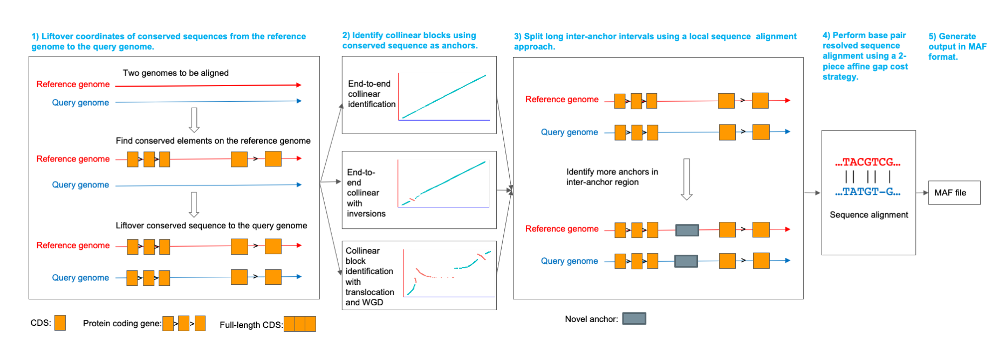

# AnchorWave &middot; [![license][license-badge]][license] [](http://bioconda.github.io/recipes/anchorwave/README.html)
<p align="center">
</p>

## Description
AnchorWave (Anchored Wavefront Alignment) identifies collinear regions via conserved anchors (full-length CDS and full-length exon have been implemented currently) and breaks collinear regions into shorter fragments, i.e., anchor and inter-anchor intervals. 
By performing sensitive sequence alignment for each shorter interval via a 2-piece affine gap cost strategy and merging them together, AnchorWave generates a whole-genome alignment for each collinear block. AnchorWave implements commands to guide collinear block identification with or without chromosomal rearrangements and provides options to use known polyploidy levels or whole-genome duplications to inform alignment.
## Principle of the AnchorWave process
<p align="center">

</p>

AnchorWave takes the reference genome sequence and gene annotation in GFF3 format as input and extracts reference full-length coding sequences (CDS) to use as anchors. 

Genome FASTA and GFF/GTF inputs may be plain text, gzip, or BGZF. AnchorWave
detects compression from the file signature, not the filename extension, so no
compression option is required. Compressed FASTA files are materialized once in
`$TMPDIR` to preserve random-access behavior, cached for the process lifetime,
and removed on normal exit. Ensure that `$TMPDIR` has enough free space for the
decompressed genomes.

Using a splice aware alignment program (minimap2 and GMAP have been tested) to lift over the start and end position of reference full-length CDS to the query genome (step 1). 
AnchorWave then identifies collinear anchors using one of three user-specified algorithm options (step 2) and uses the [WFA](https://github.com/smarco/WFA2-lib) and [minimap2](https://github.com/lh3/minimap2) algorithm to perform alignment for each anchor and inter anchor interval (step 4). Some anchor/inter-anchor regions cannot be aligned using our standard approach due to high memory and computational time costs. For these, AnchorWave either identifies novel anchors within long inter-anchor regions (step 3), or for those that cannot be split by novel anchors, aligns using the ksw_extd2 function implemented in minimap2 or a reimplemented sliding window approach (step 4). AnchorWave concatenates base pair sequence alignment for each anchor and inter-anchor region and outputs the alignment in MAF format (step 5).

Version 1.3.0 uses two strict alignment-quality tiers. The exact tier contains
WFA-Singletrack high, standard WFA high/medium/low, KSW2-Singletrack, full
KSW2, and score-certified KSW2. The fallback tier contains banded KSW2 and
`alignSlidingWindow`; the selector predicts which will return the larger score
and normally runs only that method. BiWFA is retained only in developer
benchmarks and is not part of the production selector.

The vendored WFA2 implementation is pinned to upstream
`main@2fc4a1afac0f624e7020ee5aadb7692b38157eaa`. `genoAli` and `proali`
rank all memory-feasible exact candidates dynamically: WFA-Singletrack high,
standard WFA high/medium/low, KSW2-Singletrack, full KSW2 and score-certified
KSW2. The scheduler uses the
user-specified thread and process-memory limits to minimize predicted global
completion time under the predictive `-M` admission envelope. Banded KSW2 and the
sliding-window method share the fallback tier. When both fit the per-task
budget, a versioned B73/Mo17-calibrated model predicts their score difference
and normally executes only the predicted higher-scoring method. See the
[v1.3.0 release notes](RELEASE_NOTES.md).

The KSW2-Singletrack integration is adapted from
[LorienLV/singletrack](https://github.com/LorienLV/singletrack) at commit
`7185195cb4049fd5290875ab4fc503384c4891dd`; attribution and the upstream MIT
license are retained in `minimap2/KSW2_SINGLETRACK_NOTICE`.

`genoAli` also uses `-t` during global anchor organization. Reference and query
chromosomes are scheduled through one cost-prioritized worker pool and merged
deterministically.

The sequence-alignment stage also supports bounded fine-grained inter-anchor
tasks.


Table of Contents
=================
1. [Installation](#Installation)
    1. [Installation from source code](#Installation-from-source-code)
       1. [Dependencies](#Dependencies)
       2. [Compile](#Compile)
    2. [Installation using conda](#Installation-using-conda)
    3. [Installation using Docker](#Installation-using-Docker)
2. [Usage](#Usage)
    1. [Lift over the reference CDS coordinates to the query genome](#lift-over-the-reference-cds-coordinates-to-the-query-genome-command-1-3)
    2. [Genome alignment without chromosomal rearrangement](#genome-alignment-without-chromosomal-rearrangement-an-option-of-command-4)
    3. [Genome alignment without translocation rearrangement while with inversions](#genome-alignment-without-translocation-rearrangement-while-with-inversions-an-option-of-command-4)
    4. [Genome alignment with relocation variation, chromosome fusion or whole genome duplication](#genome-alignment-with-relocation-variation-chromosome-fusion-or-whole-genome-duplication-an-option-of-command-4)
3. [Tips for following analysis](#tips-for-following-analysis)
4. [Guidelines](#walkthrough-guidelines)
5. [FAQ](#FAQ)
6. [Contact](#Contact)
7. [Founding](#Founding)
8. [Citation](#Citation)
## Installation
### Installation from source code
#### Dependencies
GNU GCC >=7.0  
CMake >= 3.10
[minimap2](https://github.com/lh3/minimap2) or [GMAP](http://research-pub.gene.com/gmap/)  
Operating System: Linux or MAC  
Memory: > 20 Gb  
 
If you would like to take the advantage of modern CPU to speed up please refer [the document for advanced installation](./installation.md).  
If you are working on a machine with ARM CPU, for example a MAC machine with M1/M2 CPU, please also refer [the document for advanced installation](./installation.md).  
If you are using old x86_64 CPUs without SSE4.1 but with SSE2, please also refer [the document for advanced installation](./installation.md).

#### Compile
```
git clone https://github.com/baoxingsong/anchorwave.git
cd anchorwave
mkdir build && cd build
cmake -DCMAKE_BUILD_TYPE=Release ..
cmake --build . -- -j4
```
You will get an executable file named ```build/anchorwave``` (native SIMD is
selected by default). See [installation.md](installation.md) for portable SIMD,
OpenMP, and test-build options.
The code has been tested under Ubuntu 20.2 and CentOS 7 with intel/AMD CPU. It should work well on other REDHAT or Debian based Linux Distributions.  
### Installation using conda
```
conda install -c bioconda -c conda-forge anchorwave
```
### Installation using Docker
Compile using your local docker with the Dockerfile in this package: \
```docker build -f docker/Dockerfile -t anchorwave ./``` \
Test the installation: \
```docker run -it anchorwave anchorwave```
```docker run -it anchorwave anchorwave gff2seq```


## Usage

In general, totally four commands are need to run through the whole pipeline.  
1) extract CDS  
2) align CDS to the reference genome  
3) align CDS to the query genome  
4) perform genome alignment    
### Note
* [AnchorWave use prior informations about whole genome duplication, chromosome rearrangement etc to guide the genome alignment, while AnchorWave could not figure out those evolution events automatically. Users need to know those informations before running AnchorWave and tune the parameters accordingly. Users might need to draw some plots to figure out if you would like to use `genoAli` or `proali`. If `genoAli` is proper, then need to think about if you would like to set `IV`.
If `proali` is proper, then need to think about how to set the values of `R`, `Q` and maybe `-e`.](#Note)
Could refer [guideline.pdf](./doc/guideline.pdf) or
[#16](https://github.com/baoxingsong/AnchorWave/issues/16) for how to do that.
* Alignment of highly diverse genomes can still take a couple of CPU days. The default `-w 100000` sets the normal per-alignment algorithm budget to `w^2 = 10,000,000,000` bytes (about 9.3 GiB) and retains its KSW2 matrix/band/window role. Sliding uses the widest window permitted by this budget; it is never narrowed merely to increase throughput. Banded KSW2 similarly uses the widest endpoint-reachable traceback band that fits. For the historical quality contract `query_length * reference_length <= w^2`, Tier 1 is mandatory and an exact candidate may request more than `w^2`; process-wide `-M` admission still applies. Within WFA, `-w` is not compared with sequence length, length difference, or alignment score outside that explicit cell-envelope rule. Set `-t` as the maximum worker count and optionally set `-M` as the predictive maximum total AnchorWave memory in GiB; omitting `-M` disables the process-wide memory envelope. When `-M` is set, AnchorWave deducts loaded-genome RSS and an internal reserve, then dynamically admits guarded algorithm predictions plus transient sequence/output storage. Because allocator peaks, caches, and sampling are not a hard RSS controller, use a cgroup or job-scheduler limit when the operating system must enforce a cap. Small tasks can use all `-t` workers without each reserving `w^2`.


Options:
```
Program anchorwave
Usage: anchorwave <command> [options]
Commands:
    gff2seq     get the longest full-length CDS for each gene
    genoAli     whole chromosome global alignment and variant calling
    proali      genome alignment with relocation variation, chromosome fusion or whole genome duplication
    ali         perform global alignment for a pair of sequences using the 2-piece affine gap cost strategy
```

### Align one sequence pair with `ali`

Both FASTA files must contain exactly one sequence; plain, gzip, and BGZF input
are auto-detected. The command writes the two gapped sequences to standard
output.

```
Usage: anchorwave ali -r refSeq.fa -s querySeq.fa
Options
 -h           produce help message
 -r   FILE    reference sequence (one-record plain or gzip/BGZF FASTA)
 -s   FILE    target sequence (one-record plain or gzip/BGZF FASTA)
 -w   INT     alignment window and normal per-alignment budget w^2 bytes
              (default: 100000, about 9.3 GiB)
              qlen*rlen <= w^2 forces Tier 1; exact memory may exceed w^2
 -bt  FLOAT   exact-DP prediction/runtime ceiling per interval in minutes (default: 0)
              0 selects exact-first mode; a positive value selects balanced mode
              qlen*rlen <= w^2 remains a mandatory Tier-1 exception
 -B   INT     mismatching penalty (default: -6)
 -O1  INT     gap open penalty (default: -8)
 -E1  INT     gap extension penalty (default: -2)
 -O2  INT     gap open penalty 2 (default: -75)
 -E2  INT     gap extension penalty 2 (default: -1)
```

### Lift over the reference full-length CDS start/stop coordinates to the query genome (command 1-3)
When extracting full-length CDS, if for a gene, there are multiple transcript isoforms, only the transcript with longest full-length CDS would be used.  
The ```gff2seq``` output the concatenated full-length CDSs.  
Options of the ```gff2seq``` function:
```
Usage: anchorwave gff2seq -i inputGffFile -r inputGenome -o outputSequences 
Options
 -h        produce help message
 -i FILE   reference GFF/GTF (plain or gzip/BGZF; auto-detected)
 -r FILE   reference FASTA (plain or gzip/BGZF; auto-detected)
 -o FILE   output file of the longest CDS/exon for each gene
 -x        use exon records instead of CDS from the GFF file
 -m INT    minimum exon length to output (default: 20)
```

#### Example
##### Data
<i>Arabidopsis thaliana</i> Col-o reference genome and GFF3 annotation file from https://www.arabidopsis.org/  
<i>Arabidopsis thaliana</i> L<i>er</i>-0 accession assembly from http://www.pnas.org/content/113/28/E4052  
We tested minimap2 and GMAP for this purpose, any other splice aware sequence alignment program should work, as long as it could generate alignment in SAM format
##### Using minimap2 for lift over
Since minimap2 could not deal with short CDS very well, and that causes error to lift over anchors to the query genome. To minimum this side effects, AnchorWave would ignore those short (-m parameter) CDS records.
```
anchorwave gff2seq -i TAIR10_GFF3_genes.gff -r tair10.fa -o cds.fa
minimap2 -x splice -t 10 -k 12 -a -p 0.4 -N 20 tair10.fa cds.fa > ref.sam
minimap2 -x splice -t 10 -k 12 -a -p 0.4 -N 20 ler.fa cds.fa > ler.sam
```

##### Alternatively using GMAP for lift over
```
anchorwave gff2seq -i TAIR10_GFF3_genes.gff -r tair10.fa -m 0 -o cds.fa

gmap_build --dir=./tair10 --genomedb=tair10 tair10.fa
gmap_build --dir=./ler --genomedb=ler ler.fa

gmap -t 10 -A -f samse -d tair10 -D tair10/ cds.fa > gmap_tair10.sam
gmap -t 10 -A -f samse -d ler -D ler/ cds.fa > gmap_ler.sam
```


### Genome alignment without chromosomal rearrangement (an option of command 4)
This module perform base pair resolution sequence alignment for two genomes. A query chromosome sequence would be aligned against the reference chromosome with the same name.  
The output would be an end-to-end sequence alignment for the whole chromosome in maf format.  
A variant calling result in vcf format could be created which is derived from the end-to-end alignment.  
Please make sure the chromosomes from reference genome and query genomes were named in the same way. Chromosomes with the same name would be aligned.
```
grep ">" ler.fa
grep ">" Col.fa
```
#### Anchors lift over using GMAP or minimap2

##### Anchors lift over using minimap2
```
anchorwave gff2seq -i TAIR10_GFF3_genes.gff -r tair10.fa -o cds.fa
minimap2 -x splice -t 10 -k 12 -a -p 0.4 -N 20 tair10.fa cds.fa > ref.sam
minimap2 -x splice -t 10 -k 12 -a -p 0.4 -N 20 ler.fa cds.fa > ler.sam
```

##### Anchors lift over using GMAP
```
anchorwave gff2seq -i TAIR10_GFF3_genes.gff -r tair10.fa -m 0 -o cds.fa
gmap_build --dir=./tair10 --genomedb=tair10 tair10.fa
gmap_build --dir=./ler --genomedb=ler ler.fa
gmap -t 10 -A -f samse -d tair10 -D tair10/ cds.fa > ref.sam
gmap -t 10 -A -f samse -d ler -D ler/ cds.fa > ler.sam
```

#### Perform alignment and variant calling:
The `-m` setting of this command should be identical with the above `gff2seq` command
##### If minimap2 was used for lift over:
```
anchorwave genoAli -i TAIR10_GFF3_genes.gff -as cds.fa -r tair10.fa -a ler.sam -ar ref.sam -s ler.fa -n ler.anchors -o ler.maf -f ler.f.maf > ler.log
```

##### If GMAP was used for lift over:
```
anchorwave genoAli -i TAIR10_GFF3_genes.gff -as cds.fa -r tair10.fa -a ler.sam -ar ref.sam -s ler.fa -n ler.anchors -o ler.maf -f ler.f.maf -m 0 > ler.log
```
The output file ```ler.anchors``` could be used to visualize collinear anchors/blocks.  
Please note: Under the global alignment model, if the block length is longer than a preset window size, the output alignment may be suboptimal. A larger ```-w``` permits a larger per-alignment memory budget. A smaller ```-fa3``` enables novel-anchor searches in more gaps, which can increase anchor-search work and change interval fragmentation.

Options of the ```genoAli``` function:
```
Usage: anchorwave genoAli -i refGffFile -r refGenome -a cds.sam -as cds.fa -ar ref.sam -s targetGenome -n outputAnchorFile -o output.maf -f output.fragmentation.maf 
Options
 -h           produce help message
 -i   FILE    reference GFF/GTF (plain or gzip/BGZF; auto-detected)
 -r   FILE    reference FASTA (plain or gzip/BGZF; auto-detected)
 -as  FILE    anchor sequence file. (output from the gff2seq command)
 -a   FILE    sam file generated by mapping conserved sequence to query genome
 -s   FILE    target FASTA (plain or gzip/BGZF; auto-detected)
              Those sequences with the same name in the reference genome and query genome file would be aligned
 -n   FILE    output anchors file
 -o   FILE    output file in maf format
 -f   FILE    output sequence alignment for each anchor/inter-anchor region in maf format
 -b   FILE    output the actual alignment method for each interval in BED format
              WFA modes: WAVEFRONT; exact KSW2 modes: KSW2
              fallback modes: BANDED_KSW2 or SLIDING_WINDOW
 -t   INT     maximum number of anchor-organization and alignment threads (default: 1)
 -M   FLOAT   predictive maximum total AnchorWave memory in GiB
              omitted by default (no process-wide memory envelope)
              enables dynamic scheduling; must be at least w^2 bytes
              not an operating-system-enforced hard RSS limit
 -bt  FLOAT   exact-DP prediction/runtime ceiling per interval in minutes (default: 0)
              0 selects exact-first mode; a positive value selects balanced mode
              qlen*rlen <= w^2 remains a mandatory Tier-1 exception
 -m   INT     minimum exon length to use (default: 20, should be identical with the setting of gff2seq function)
 -mi  DOUBLE  minimum full-length CDS anchor hit similarity to use (default:0.95)
 -mi2 DOUBLE  minimum novel anchor hit similarity to use (default:0.2)
 -ar  FILE    sam file generated by mapping conserved sequence to reference genome
 -w   INT     alignment window and normal per-alignment budget w^2 bytes
              (default: 100000, about 9.3 GiB per alignment)
              qlen*rlen <= w^2 forces Tier 1; exact memory may exceed w^2
 -fa3 INT     minimum side length for novel-anchor search: require
              reference_length * query_length > fa3^2 (default: 50000)
 -B   INT     mismatching penalty (default: -6)
 -O1  INT     gap open penalty (default: -8)
 -E1  INT     gap extension penalty (default: -2)
 -O2  INT     gap open penalty 2 (default: -75)
 -E2  INT     gap extension penalty 2 (default: -1)
 -IV          whether to call inversions (default: false)
 -IC  DOUBLE  penalty for having a non-linear match in inversion region (default: -1)
              We use IC * alignment_similarity as the penalty in the inversion block
 -I   DOUBLE  minimum score to keep an inversion (default: 2)
 -e   INT     maximum expected copy number of each gene on each chromosome (default: 1)
              This prevents using tandem duplicated genes to identify collinear block
 -y   DOUBLE  minimal ratio of e+1 similarity to 1 similarity to drop an anchor (default: 0.6)
 -ns          do not search for new anchors (default: false)
 -x           use exon records instead of CDS from the GFF file (should be identical with the setting of gff2seq function)
```
### Genome alignment without translocation rearrangement while with inversions (an option of command 4)
This module perform base pair resolution sequence alignment for two genomes. A query chromosome sequence would be aligned against the reference chromosome with the same name end-to-end.  
The output could be end-to-end sequence alignment for the whole chromosome in maf format.  
#### Data
Maize B73 v4 reference genome and GFF3 annotation file;  
Maize Mo17 assembly.
```
wget https://ftp.ensemblgenomes.ebi.ac.uk/pub/plants/release-34/gff3/zea_mays/Zea_mays.AGPv4.34.gff3.gz
wget https://ftp.ensemblgenomes.ebi.ac.uk/pub/plants/release-34/fasta/zea_mays/dna/Zea_mays.AGPv4.dna.toplevel.fa.gz
wget https://download.maizegdb.org/Zm-Mo17-REFERENCE-CAU-1.0/Zm-Mo17-REFERENCE-CAU-1.0.fa.gz
# All three .gz files can be supplied directly; these commands are optional.
gunzip Zea_mays.AGPv4.34.gff3.gz
gunzip Zea_mays.AGPv4.dna.toplevel.fa.gz
gunzip Zm-Mo17-REFERENCE-CAU-1.0.fa.gz
```
Please make sure the chromosomes from reference genome and query genomes were named in the same way. Chromosomes with the same names would be aligned.
```
grep ">" Zm-Mo17-REFERENCE-CAU-1.0.fa
grep ">" Zea_mays.AGPv4.dna.toplevel.fa
```
Use this command to rename each chromosome for Zm-Mo17-REFERENCE-CAU-1.0.fa:
```
sed -i 's/>chr/>/g' Zm-Mo17-REFERENCE-CAU-1.0.fa
```
#### Anchors lift over:
##### Ｕsing minimap2 for lift over:
```
anchorwave gff2seq -i Zea_mays.AGPv4.34.gff3 -r Zea_mays.AGPv4.dna.toplevel.fa -o cds.fa
minimap2 -x splice -t 10 -k 12 -a -p 0.4 -N 20 Zm-Mo17-REFERENCE-CAU-1.0.fa cds.fa > cds.sam
minimap2 -x splice -t 10 -k 12 -a -p 0.4 -N 20 Zea_mays.AGPv4.dna.toplevel.fa cds.fa > ref.sam
```

##### Alternatively　Using GMAP　for lift over:
```
anchorwave gff2seq -i Zea_mays.AGPv4.34.gff3 -r Zea_mays.AGPv4.dna.toplevel.fa -m 0 -o cds.fa
gmap_build --dir=./B73 --genomedb=B73 Zea_mays.AGPv4.dna.toplevel.fa
gmap_build --dir=./Mo17 --genomedb=Mo17 Zm-Mo17-REFERENCE-CAU-1.0.fa
gmap –t 10 -A -f samse -d B73 -D B73/ cds.fa > ref.sam
gmap –t 10 -A -f samse -d Mo17 -D Mo17/ cds.fa > cds.sam
```

#### Perform alignment using the ```genoAli``` function with parameter ```-IV```:
The `-m` setting of this command should be identical with the above `gff2seq` command
##### If minimap2 was used for lift over:
```
anchorwave genoAli -i Zea_mays.AGPv4.34.gff3 -as cds.fa -r Zea_mays.AGPv4.dna.toplevel.fa -a cds.sam -ar ref.sam -s Zm-Mo17-REFERENCE-CAU-1.0.fa -n anchors -o anchorwave.maf -f anchorwave.f.maf -IV
```

##### If GMAP was used for lift over:
```
anchorwave genoAli -i Zea_mays.AGPv4.34.gff3 -as cds.fa -r Zea_mays.AGPv4.dna.toplevel.fa -a cds.sam -ar ref.sam -s Zm-Mo17-REFERENCE-CAU-1.0.fa -n anchors -o anchorwave.maf -f anchorwave.f.maf -IV -m 0
```

This command might still cost a couple of days. WFA-Singletrack high and WFA high are fast exact paths; memory-feasible intervals can also use medium/low WFA, KSW2-Singletrack, full KSW2 or score-certified KSW2. The latter computes the unbanded global optimum without traceback and accepts an adaptively widened traceback only when its score is identical. The normal per-attempt algorithm ceiling is `w^2`; when `query_length * reference_length <= w^2`, however, Tier 1 remains mandatory and all exact engines may compete with a larger predicted footprint if process-wide `-M` admission permits it. An immediately runnable high WFA that is no slower than the fastest calibrated exact runtime is not charged the normal memory-shadow penalty, but a faster KSW2 path still wins. If current memory is busy, AnchorWave compares predicted wait plus runtime across exact candidates, parks eligible gap tasks without occupying a worker, and drains memory near the workload tail or after aging. The default `-bt 0` selects exact-first mode and disables exact runtime deadlines. Setting a positive value selects balanced mode: P50 and P90 plus cumulative exact-attempt runtime must be within `-bt`, except for the mandatory `query_length * reference_length <= w^2` Tier-1 contract. Only after eligible exact candidates are exhausted or that explicit deadline is reached does the shared fallback tier run. Banded KSW2 and sliding window use the normal per-attempt ceiling. At the default scoring parameters and `-w 100000`, a versioned paired B73/Mo17 model predicts `score(banded)-score(sliding)` and uses a conservative one-sided rule to select the expected higher-scoring result; out-of-domain settings use a deterministic analytic score-loss rule. The second approximate method is normally only a runtime-failure rescue, not a mandatory validation run. Long predicted gaps are prefetched early within a bounded rolling window while results are still emitted in anchor order. `-M` is a predictive in-process envelope with an internal reserve, not an operating-system hard cap; use a cgroup or job-scheduler memory limit when kill-at-cap enforcement is required. Reducing ```-fa3``` changes novel-anchor splitting and can affect runtime and alignment quality.

Version 1.3.0 uses `-fa3 50000` by default; use `-fa3 100000` to reproduce the
former threshold. Reducing `-fa3` enables novel-anchor search in more gaps. It
can increase the number of local anchors, change interval fragmentation, and
affect runtime and alignment quality.

Version 1.3.0 fixes a historical 32-bit overflow in the `-fa3` comparison.
Novel-anchor search now consistently requires
`reference_length * query_length > fa3^2`. Consequently, an anchor file made
with v1.3.0 can contain fewer novel anchors than one made by an affected older
build at the same explicit parameter value; this is an intentional correctness
change.

### Genome alignment with relocation variation, chromosome fusion or whole genome duplication (an option of command 4)
When comparing two genomes undergone different genome duplications (goldfish genome, plant genomes and maybe hexapod genomes), this program implemented algorithm to identify collinear blocks with user specified coverage, and perform base pair resolution genome alignment for each collinear block.  \
The alignment depth thresholds are the parameters ‘-R’ and ‘-Q’. They are used to control the alignment depth for the reference genome and query genome. ’-R’ is the maximum alignment depth for the reference genome, and ‘-Q’ is the maximum alignment depth for the query genome. For example, the maize genome has an additional round of whole-genome duplication compared to the sorghum genome, so we set the maximum alignment depth of the maize genome as 1 and the maximum alignment depth of the sorghum genome as 2. We use parameters ‘-R 1 -Q 2’ to align the sorghum genome against the maize genome. 

The outputs of this function are end-to-end sequence alignments for each collinear block in maf format.  
  
Data: maize B73 genome sequence and GFF3 annotation file from [http://plants.ensembl.org/Zea_mays/Info/Index](http://plants.ensembl.org/Zea_mays/Info/Index);  
and sorghum genome sequence from [https://plants.ensembl.org/Sorghum_bicolor/Info/Index](https://plants.ensembl.org/Sorghum_bicolor/Info/Index).  
  
This function does not need the reference and query genomes having identical chromosome names.
#### Anchors lift over:

##### Using minimap2:
```
anchorwave gff2seq -r Zea_mays.AGPv4.dna.toplevel.fa -i Zea_mays.AGPv4.34.gff3 -o cds.fa
minimap2 -x splice -t 10 -k 12 -a -p 0.4 -N 20 Sorghum_bicolor.Sorghum_bicolor_NCBIv3.dna.toplevel.fa cds.fa > cds.sam
minimap2 -x splice -t 10 -k 12 -a -p 0.4 -N 20 Zea_mays.AGPv4.dna.toplevel.fa cds.fa > ref.sam
```

##### Using GMAP:
```
anchorwave gff2seq -r Zea_mays.AGPv4.dna.toplevel.fa -i Zea_mays.AGPv4.34.gff3 -o cds.fa -m 0
gmap_build --dir=./B73 --genomedb=B73 Zea_mays.AGPv4.dna.toplevel.fa
gmap_build --dir=./sorghum --genomedb=sorghum Sorghum_bicolor.Sorghum_bicolor_NCBIv3.dna.toplevel.fa
gmap –t 10 -A -f samse -d B73 -D B73/ cds.fa > ref.sam
gmap –t 10 -A -f samse -d sorghum -D sorghum/ cds.fa > cds.sam
```


#### Perform alignment using the ```proali``` function:
##### If minimap2 was used for lift over:
```
anchorwave proali -i Zea_mays.AGPv4.34.gff3 -as cds.fa -r Zea_mays.AGPv4.dna.toplevel.fa -a cds.sam -ar ref.sam -s Sorghum_bicolor.Sorghum_bicolor_NCBIv3.dna.toplevel.fa -n anchors -R 1 -Q 2 -o alignment.maf -f alignment.f.maf
```

##### If GMAP was used for lift over:
```
anchorwave proali -i Zea_mays.AGPv4.34.gff3 -as cds.fa -r Zea_mays.AGPv4.dna.toplevel.fa -a cds.sam -ar ref.sam -s Sorghum_bicolor.Sorghum_bicolor_NCBIv3.dna.toplevel.fa -n anchors -R 1 -Q 2 -o alignment.maf -f alignment.f.maf -m 0
```

Options of the ```proali``` function:
```
Usage: anchorwave proali -i refGffFile -r refGenome -a cds.sam -as cds.fa -ar ref.sam -s targetGenome -n outputAnchorFile -o output.maf -f output.fragmentation.maf -R 1 -Q 1
Options
 -h           produce help message
 -i   FILE    reference GFF/GTF (plain or gzip/BGZF; auto-detected)
 -r   FILE    reference FASTA (plain or gzip/BGZF; auto-detected)
 -as  FILE    anchor sequence file. (output from the gff2seq command)
 -a   FILE    sam file by mapping conserved sequence to query genome
 -s   FILE    target FASTA (plain or gzip/BGZF; auto-detected)
 -n   FILE    output anchors file
 -o   FILE    output file in maf format
 -f   FILE    output sequence alignment for each anchor/inter-anchor region in maf format
 -b   FILE    output the actual alignment method for each interval in BED format
              WFA modes: WAVEFRONT; exact KSW2 modes: KSW2
              fallback modes: BANDED_KSW2 or SLIDING_WINDOW
 -t   INT     maximum number of anchor-organization and alignment threads (default: 1)
 -M   FLOAT   predictive maximum total AnchorWave memory in GiB
              omitted by default (no process-wide memory envelope)
              enables dynamic scheduling; must be at least w^2 bytes
              not an operating-system-enforced hard RSS limit
 -bt  FLOAT   exact-DP prediction/runtime ceiling per interval in minutes (default: 0)
              0 selects exact-first mode; a positive value selects balanced mode
              qlen*rlen <= w^2 remains a mandatory Tier-1 exception
 -fa3 INT     minimum side length for novel-anchor search: require
              reference_length * query_length > fa3^2 (default: 50000)
 -w   INT     alignment window and normal per-alignment budget w^2 bytes
              (default: 100000, about 9.3 GiB per alignment)
              qlen*rlen <= w^2 forces Tier 1; exact memory may exceed w^2
 -R   INT     reference genome maximum alignment coverage 
 -Q   INT     query genome maximum alignment coverage 
 -B   INT     mismatching penalty (default: -4)
 -O1  INT     open gap penalty (default: -4)
 -E1  INT     extend gap penalty (default: -2)
 -O2  INT     open gap penalty 2 (default: -80)
 -E2  INT     extend gap penalty 2 (default: -1)
 -m   INT     minimum exon length to use (default: 20, should be identical with the setting of gff2seq function)
 -mi  DOUBLE  minimum full-length CDS anchor hit similarity to use (default:0.95)
 -mi2 DOUBLE  minimum novel anchor hit similarity to use (default:0.2)
 -e   INT     maximum expected copy number of each gene on each chromosome (default: 1)
              This prevents using tandem duplicated genes to identify collinear block
 -y   DOUBLE  minimal ratio of e+1 similarity to 1 similarity to drop an anchor (default: 0.6)
 -ar  FILE    sam file by mapping conserved sequence to reference genome
              this is used to improve the accuracy of anchors mapping
 Following parameters are to identify collinear blocks
 -d   DOUBLE  calculate IndelDistance (default: 3)
 -O   DOUBLE  chain open gap penalty (default: -0.03)
 -E   DOUBLE  chain extend gap penalty (default: -0.01)
 -I   DOUBLE  minimum chain score (default: 2)
 -D   INT     maximum gap size for chain (default: 25)
 -ns          do not search for new anchors (default: false)
 -x           use exon records instead of CDS from the GFF file (should be identical with the setting of gff2seq function)
```
<span style='color: #00ffff;'>The setting of -Q and -R is essential for the `proali` function.</span> You could refer the [walkthrough guidelines](./doc/guideline.pdf) for how to set them.

## Tips for following analysis
The [maf-convert](https://gitlab.com/mcfrith/last/-/blob/main/bin/maf-convert) script could be used to reformat the MAF format file into several different formats.  
For example, reformat maize B73 against Mo17 alignment into sam and bam format:
```
python2 maf-convert sam anchorwave.maf | sed 's/[0-9]\+H//g' > anchorwave.sam
cat anchorwave.sam | samtools view -O BAM --reference Zea_mays.AGPv4.dna.toplevel.fa - | samtools sort - > anchorwave.bam
samtools index anchorwave.bam
```
The [bioconvert](https://github.com/bioconvert/bioconvert) is very efficient to reformat the alignments into bam or paf:
```
bioconvert maf2sam anchorwave.maf anchorwave.sam
bioconvert sam2paf anchorwave.bc.sam anchorwave.paf
cat anchorwave.sam | sed 's/[0-9]\+H//g' | samtools view -O BAM --reference Zea_mays.AGPv4.dna.toplevel.fa - | samtools sort - > anchorwave.bam
samtools index anchorwave.bam
```
If you would like to swap reference and query sequence, there is no need to re-run AnchorWave, which is computational cost.  
The script  [maf-swap](https://gitlab.com/mcfrith/last/-/blob/main/bin/maf-swap)  could be used for this aim:
```
cat anchorwave.maf | python2 maf-swap >anchorwave_swap.maf
bioconvert maf2sam anchorwave_swap.maf anchorwave_swap.sam
bioconvert sam2paf anchorwave_swap.bc.sam anchorwave_swap.paf
cat anchorwave_swap.sam | sed 's/[0-9]\+H//g' | samtools view -O BAM --reference Zm-Mo17-REFERENCE-CAU-1.0.fa - | samtools sort - > anchorwave_swap.bam
samtools index anchorwave_swap.bam
```
If you would like to reformat MAF files into (G)VCF or track the coordinates on query genome and the reference genome,
please refer the MAF to G(VCF) [pipeline](https://github.com/baoxingsong/AnchorWave/blob/master/doc/GATK.md).

## Walkthrough guidelines
A more detailed guideline for which algorithm to use, how to visualize the results and how to select parameters could be found at the [walkthrough guidelines](./doc/guideline.pdf).  
More examples and comparsion with other tools could be found at [genome alignment](https://github.com/baoxingsong/genomeAlignment).
## FAQ
The [FAQ](./FAQ.md) document is available at [FAQ.md](./FAQ.md).

## Contact
Bug report? Any question? Any suggestion? Any requirement? Want to collaborate?  
Please feel free to send E-mail to songbaoxing168@163.com.
## Founding
This work is funded by NSF [#1822330](https://nsf.gov/awardsearch/showAward?AWD_ID=1822330).

## Citation
[Baoxing Song, Santiago Marco-Sola, Miquel Moreto, Lynn Johnson, Edward S. Buckler, Michelle C. Stitzer.
AnchorWave: Sensitive alignment of genomes with high sequence diversity, extensive structural polymorphism, and whole-genome duplication.
Proceedings of the National Academy of Sciences Jan 2022, 119 (1) e2113075119; DOI: 10.1073/pnas.2113075119](https://www.pnas.org/content/119/1/e2113075119)

[Shuai Wang, Qinlin Xu, Baoxing Song.
Applying AnchorWave to Address Plant Genome Alignment.
Bio-protocol Oct 2023; DOI: 10.21769/BioProtoc.4830](https://bio-protocol.org/exchange/protocoldetail?id=4830&type=1)

[license]: ./LICENSE
[license-badge]: https://img.shields.io/badge/license-MIT-blue.svg
