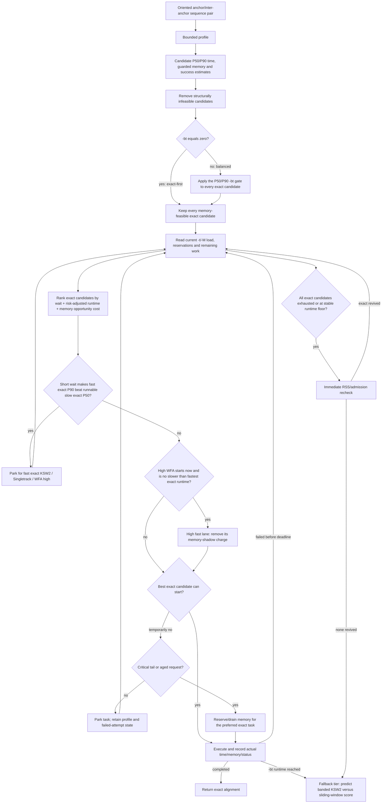

# Dynamic sequence-alignment selector

## Contract

The selector has a lexicographic objective:

1. admit work inside the user-provided process-memory envelope (`-M`) and
   per-attempt time policy (`-bt`);
2. remain in the exact dynamic-programming tier whenever any exact candidate
   is structurally and, in balanced mode, time feasible;
3. within that tier, minimize the predicted completion time of the complete
   workload, not the runtime of an isolated interval;
4. use lower memory and lower failure risk to break close choices.

The two quality tiers are fixed:

1. exact DP: WFA-Singletrack high, WFA high, WFA medium, WFA low,
   unbanded KSW2 and rescue-only score-certified KSW2;
2. fallback alignment: banded KSW2 or `alignSlidingWindow`, selected by
   predicted alignment-score loss with runtime used only as a tie-breaker.

Temporary memory pressure never makes an exact-capable task enter tier 2.
Such a task selects another exact engine or parks until memory is available.
Resident output/cache pressure begins as temporary, but it cannot defer one
interval forever: after a bounded stable-RSS observation it becomes a dynamic
runtime floor for that candidate. This is distinct from startup-size
infeasibility. The dispatcher immediately samples RSS once more at the exact
tier boundary, then opens banded KSW2 only if every exact candidate is
structurally infeasible, excluded by the explicit time policy, has failed, or
is blocked by a confirmed runtime floor. A synchronous caller gets an explicit
error while pressure is still temporary and it cannot park.

## Runtime decision



For an exact candidate, the current risk-adjusted runtime is

```text
R = P50 + 0.35 * (P90 - P50) + (1 - success_probability) * P90
```

and the non-tail system cost is

```text
wait + R + R * reservation_fraction * backlog_pressure
```

The memory opportunity term is derived at runtime from the requested worker
count, task-memory capacity, active reservations, untracked RSS and outstanding
work. It is therefore not tied to one of the anticipated machines. A high-WFA
candidate that can start immediately and is no slower than the fastest
calibrated exact runtime is not charged this memory shadow. This prefers a
genuinely fast high-WFA path without forcing it ahead of a faster KSW2 matrix.
At the critical tail the shadow price is zero for every exact engine.

There is a separate short-wait dominance rule so a memory-light but very slow
exact engine does not start while a fast exact engine is about to become
admissible. For fast `F` in `{KSW2-full, Singletrack, WFA-high}` and immediately
runnable slow `S` in `{WFA-medium, WFA-low}`, the task parks only when

```text
wait_F + P90_F + shadow_F + max(1 second, 0.10 * P90_F)
    < P50_S + shadow_S
```

and `wait_F` is no more than both two minutes and the positive time slack in
that inequality. Thus an uncertain or long wait never gets disguised as a
short poll. This P90-versus-P50 comparison deliberately favours starting the
slow candidate when the evidence is close.

The candidate vector remains in a deterministic order only as a tie-break.
The executor does not blindly run it from front to back.

## Meaning of `-t`, `-M`, `-w` and `-bt`

- `-t` is the maximum worker count. The memory scheduler does not reduce this
  statically; it admits the number of currently fitting tasks dynamically.
- `-M` is the requested total AnchorWave memory envelope in GiB. Baseline RSS,
  retained post-task RSS and an in-budget safety reserve are removed before
  task admission. It is an in-process predictive guard, not an operating-system
  hard limit; use a cgroup/job-scheduler limit when a non-negotiable kill-at-cap
  boundary is required.
- `-w` is the hard per-alignment algorithm-memory ceiling `w^2` for every WFA
  mode, full/score-certified/banded KSW2, and the sliding-window sizing logic.
  `-M` cannot raise this limit; it controls aggregate admission of guarded task
  predictions plus transient sequence/output storage. The requested sliding
  chunk is reduced internally to the largest square KSW2 traceback that the
  page-aware model proves fits `w^2`; the default 100 kb request is therefore
  not assumed to occupy exactly 10 GB.
- `-bt` defaults to zero. Zero selects **exact-first** mode and disables
  predicted-time filtering and runtime deadlines for every exact engine. A
  positive value selects **balanced** mode and applies one rule to every exact
  candidate: every duration quantile used for admission must be at most
  `-bt`. The current model requires both `P50 <= -bt` and `P90 <= -bt`; a future
  P95/P99 admission estimate must satisfy the same ceiling. During execution,
  the cumulative exact-attempt wall time for the interval is limited to the
  remaining `-bt` budget by cooperative WFA and KSW2 progress probes. A timed
  out exact attempt returns no partial alignment and opens the existing
  banded/sliding fallback. Temporary memory occupancy never changes this
  filter or opens a lower quality tier by itself.

The in-budget process reserve is approximately

```text
clamp(2.5% of -M + 64 MiB * -t, 1 GiB, 32 GiB)
```

Each WFA prediction receives 25% model headroom and then a 15% allocator/abort
guard. KSW2 receives 10% prediction headroom and the same guard. Transient
input/output storage is included in the reservation. WFA2's allocator-level
`max_memory_abort` remains the final per-attempt safety mechanism.

An RSS rise caused by caches or completed output is classified as runtime
pressure, not structural single-task infeasibility. The scheduler carries the
observed post-reservation RSS residual into later admissions instead of losing
it when a task releases its token. Deferred tasks retain their sequence profile
and attempted-candidate state, avoiding repeated sketch construction.

Runtime admission exposes five states rather than one boolean:

| state | meaning | selector action |
|---|---|---|
| `Ready` | request fits the same live RSS/reservation formula used by admission | start now |
| `TrackedWait` | known active reservations provide a finite release time | compare the real wait with other exact engines |
| `CoolingRss` | RSS may fall, but no finite tracked-release bound proves it | keep it temporary; park/retry rather than cross tier |
| `StableRuntimeFloor` | no tracked releaser and the blocked RSS floor remained stable for 30 seconds | try other exact engines; do the final instantaneous recheck before tier 2 |
| `StaticInfeasible` | guarded reservation exceeds startup single-task capacity | remove the candidate |

The stable-floor timer belongs to one retained interval/candidate state, not
to a byte-size global bucket. A meaningful RSS fall is the larger of 256 MiB
and 1% of `-M`; it updates the progress clock. The classifier requires at
least 30 seconds blocked and five seconds without such progress. Active
reservations and older preferred requests suppress floor aging because they
are still possible releasers. The clock and RSS reader are injectable in unit
tests, so the boundary does not depend on sleeps or host memory noise.

## Sequence and resource model

The deterministic profiler samples oriented 15-mers, targets 4,096 sketch
entries and caps the sketch at 8,192. It records:

- query/reference lengths and length ratio;
- ambiguous-base and low-complexity fractions;
- sketch Jaccard, unique-anchor fraction and chained-anchor fraction;
- diagonal MAD/P90/P99 and maximum diagonal jump;
- a point score estimate, conservative memory-tail score, confidence and
  uncertainty.

The conservative score deliberately reacts to weak sketch support and local
diagonal discontinuity so balanced indels are not hidden by net length
difference. Time and memory use different score quantiles: inflating memory
safety no longer automatically makes an engine look slow.

Current B73/Mo17-calibrated analytic constants are centralized in
`AlignmentAlgorithmSelector.cpp`:

| candidate | memory model | time/work model |
|---|---|---|
| Singletrack WFA | `32 MiB + 8*S_mem^2 + recycled I/D pool` | score-stratified P50 × 0.15–0.85; conservative-score P90 at 3.0e8 score²/s |
| WFA high | `16 MiB + 32*S_mem^2` | WFA core × 1.25 |
| WFA medium | `72 MiB + 16*S_mem^2` | WFA core × 20 |
| WFA low | `72 MiB + 8*S_mem^2` | WFA core × 25 |
| KSW2 score-certified | maximum of score-only and the largest planned traceback resident-page set | exact score plus cumulative geometric traceback work and failed-certification fallback cost |
| KSW2 full | union of SIMD-rounded anti-diagonal pages actually touched, plus linear work arrays | `q*r / 1.45e9` cells/s |
| KSW2 banded | enabled only if `band >= max(q,r)` and the resulting complete matrix fits `w^2` | complete-matrix KSW2 work |
| sliding window | page-aware KSW2 chunk estimate at the memory-safe effective window | `max(q,r)*effective_window / 5.2e9` |

The WFA time model includes a linear scan term at 4.3 million bases/s and a
score-squared term at 460 million units/s, so identical and highly similar
long sequences no longer have a predicted runtime of zero. Singletrack keeps
an aggressive score-stratified P50 but prices its tail from both the point and
conservative scores. The scheduler and balanced-mode `-bt` gate use both
quantiles.

KSW2 normally uses its optimized A/C/G/T kernel. If either input contains an
ambiguous base it switches to generic scoring, where equal ambiguous symbols
match and unequal symbols receive the same mismatch penalty as WFA. The model
prices this B73/Mo17-measured path at 1.9 times the cell work. This is required
for every tier-1 engine to optimize the same two-piece-affine objective.

The fallback KSW2 gate deliberately rejects every narrow band. It is eligible
only when the configured band is at least the longer input sequence and the
complete traceback still fits `w^2`. At that width its score is mathematically
the same as full KSW2; retaining the separate tier label preserves the public
fallback taxonomy without allowing a speed shortcut to reduce alignment
quality.

Sliding-window fallback previously ran KSW2 twice per chunk: a score-only pass selected
the better sequence end, then a second complete DP pass reconstructed that
prefix. `KSW_EZ_SEMIGLOBAL_END` now retains traceback in the first pass and
backtracks directly from the better end, using the same equality rule as the
old code. On three real B73/Mo17 blocks (34.6--79.5 kb), the SSE paired
benchmark reduced wall time by 38.3--40.7%; the native AVX512 79.5-kb check
reduced it from 7.22 s to 5.20 s. Every paired score and alignment hash was
identical. Output strings are also reserved once and endpoint reconstruction
is checked without making two temporary gapped-string copies per chunk.

Score-certified KSW2 is a rescue path only when Singletrack, WFA-high and
full-KSW2 are all structurally memory-infeasible. It first runs unbanded
score-only KSW2 to obtain the global
optimum `S*`, then reconstructs with a chain-informed band. It accepts output
only when the reconstructed score equals `S*`; otherwise the band doubles
geometrically until the guarded hardware-dependent cap is reached. Score-only
and traceback allocations do not coexist. Admission therefore reserves the
peak of score-only and the largest planned traceback attempt, while the time
model still sums the work of every geometric expansion. Rescue uses at most the
same `w^2` algorithm budget as every other per-task engine; `-M` may delay it
but cannot enlarge its band. The
normal backlog memory-shadow cost prevents that reservation from crowding out
faster aggregate work; the shadow vanishes at the critical tail. If
certification still fails, the selector continues through the remaining exact
candidates before entering tier 2.

The full-KSW2 model follows the actual `km=0` malloc layout. For each
anti-diagonal it computes the live SIMD-rounded width, maps that row prefix to
OS pages, takes the page union, and adds fully touched linear arrays. Large
traceback allocations are page-aligned on the supported malloc paths; one
extra page covers allocator/header displacement. Invalid lengths or arithmetic
overflow return an infeasible maximum. No empirical 0.60 or 0.75 factor is
applied.

## Tail detection and task ordering

The executor exposes two tail signals. `globalTailPhase` is based on all
remaining work rather than the old `outstanding <= 2 * threads` rule. It is
entered when either:

- outstanding tasks are at most `max(2, threads/8)`; or
- at most half a machine of tasks remains and one task accounts for at least
  two thirds of predicted remaining work.

This prevents a 96/128-thread run from being marked as tail immediately.
`admissionTailPhase` additionally detects an ordered rolling-window head that
blocks submission of later descriptors. Dormant future descriptors still
count toward global completion progress, but only ready, deferred and active
tasks (`schedulableTasks`) enter the current memory-shadow backlog. When the
ordered head consumes that schedulable frontier, admission-tail mode removes
the shadow so a fast large-memory exact engine is not penalized by work that
cannot run yet.

Gap task state survives deferral, and workers can run other ready tasks while a
large-memory request waits. Before submission, each expensive gap receives a
compact reusable selection plan and a priority derived from the fastest
risk-adjusted candidate in its best available tier. Within each collinear
block, half of the bounded rolling window protects the next anchor-order
frontier and the other half prefetches the longest predicted work globally.
Results are still consumed strictly in anchor order. This starts likely tail
tasks early without retaining chromosome-scale sequence copies or unbounded
alignment strings, and the precomputed profile is reused by the actual attempt.

## Telemetry

The normal terminal output remains compact: one scheduler line and one
selector line per completed alignment stage. Per-interval telemetry is an
internal developer interface, intentionally hidden from public CLI help:

```bash
anchorwave genoAli ... --alignment-trace alignment-trace.tsv
```

Trace model `b73-mo17-v7` writes planned and actual rows containing sequence
features, ambiguous fraction, all candidate P50/P90 estimates, predicted and
reserved memory, predicted wait, actual wall time/score/allocator memory,
process RSS, active reservations, worker/backlog state, tail state and failure
class. It also records the configured/remaining exact runtime budget and, for
score-certified KSW2, the initial/maximum/final band, traceback-attempt count
and score-only optimum. It is written to a file, never to the progress stream.
When tracing is disabled, attempt recording takes an atomic no-lock fast exit
before collecting RSS, resource, or executor snapshots.

For counterfactual checks, build with `ANCHORWAVE_BUILD_BENCHMARKS=ON` and use
`anchorwave_exact_candidate_benchmark FRAGMENT_MAF BLOCK [MEMORY_BYTES]`. It
runs one real block through KSW2 and every WFA mode without adding a production
force-algorithm option. The standalone benchmark retains BiWFA for historical
counterfactual comparison; the production selector does not plan or execute it.

## B73/Mo17 calibration and validation

The BiWFA measurements in this section are retained as historical evidence
from selector versions before `b73-mo17-v7`. They do not describe the current
production candidate chain.

Both rounds use the first 4 Mb of B73/Mo17 chromosome 1 with the installation
data, `-t 12 -M 85 -w 100000 -bt 30 -IV`; those two calibration rounds did not
start a whole-genome run.

| metric | round 1 | tuned strict round 2 | change |
|---|---:|---:|---:|
| wall time | 116.28 s | **90.00 s** | **-22.6%** |
| sampled peak RSS | 45.97 GiB | **19.25 GiB** | **-58.1%** |
| exact completed intervals | 244/244 | **244/244** | unchanged |
| exact runtime failures | 4 | **0** | -4 |
| banded/sliding executions | 0/0 | **0/0** | unchanged |
| Singletrack / KSW2 full / BiWFA | 186 / 56 / 1 | **149 / 94 / 1** | dynamic mix |
| medium WFA | 1 | **0** | avoided slow retry |

The tuned run's 82.41-second BiWFA interval is the dominant critical path, so
90 seconds is already close to the lower bound of this workload under the
current single-thread-per-alignment engines.

Correctness checks:

- semantic anchor rows are identical between rounds;
- all 253 fragment blocks are valid, coordinates are unchanged and both
  genomes reconstruct to exactly 8,000,000 ungapped bases;
- every tuned block's declared score equals an independent recomputation with
  penalties `6,8,2,75,1`;
- the old KSW2 wildcard objective was exposed in five N-rich blocks; after the
  strict ambiguous-base fix, all five improve under the common objective;
- the diagnostic block containing 499 `N` bases returns score `-10750` from
  KSW2, Singletrack, WFA high/medium/low and BiWFA.

### Exact-first/balanced and LPT regression (2026-08-10)

The final policy was rerun on the same real 4-Mb B73/Mo17 input with
`-t 12 -M 85 -w 100000` in both modes:

| mode | option | wall time | peak RSS | exact / filling | banded / sliding |
|---|---|---:|---:|---:|---:|
| balanced | `-bt 30` | 15.61 s | 27.97 GiB | 244 / 9 | 0 / 0 |
| exact-first | `-bt 0` | 15.23 s | 28.04 GiB | 244 / 9 | 0 / 0 |

Both runs exported 160 `WAVEFRONT`, 84 `MINIMAP2`, and 9 `FILLING` records.
Their MAF, fragment MAF, method BED and semantic anchor hashes are identical;
only the raw anchor command header differs. All 253 fragment coordinates and
ungapped sequences match the historical selector baseline. Independent
two-piece-affine rescoring finds zero declared-score inconsistencies in the new
output; four inconsistent historical blocks are replaced by better exact-DP
scores. This compact input contains no exact candidate that crosses the
30-minute balanced boundary, so equality between modes is expected; the
candidate-level threshold cases are covered by unit tests.

Results are stored in
`AnchorWave-wfa2-benchmark-data/installation/selector-bt-balanced-lpt-4m-20260810/`
and
`AnchorWave-wfa2-benchmark-data/installation/selector-bt-exact-first-lpt-4m-20260810/`.

### Strict-time and score-certified confirmation (2026-08-10)

The post-change production path was run once more on the same 4-Mb B73/Mo17
input with `-t 12 -M 85 -w 100000 -bt 30`:

| metric | result |
|---|---:|
| wall time | 15.08 s |
| GNU-time peak RSS | 27.91 GiB |
| exact / filling intervals | 244 / 9 |
| banded / sliding intervals | 0 / 0 |
| WAVEFRONT / MINIMAP2 / FILLING | 160 / 84 / 9 |
| feasible exact rows violating P50/P90 <= 30 | 0 |

MAF, fragment MAF, method BED and semantic anchors are byte-identical to the
previous balanced result; only the raw anchor command header differs. The v6
trace contains 2,684 planned/attempt rows and all 244 non-filling intervals
completed in the exact tier.

A separate real 86,251-by-86,327-base B73/Mo17 gap exercised the new path. With
a 64-GiB isolated budget it certified score `-129179` after bands 5,958,
11,916 and 23,832 in 6.42 seconds; sequence reconstruction succeeded. The
model predicted P50 5.84 seconds, P90 13.11 seconds and a conservative
15.65-GB retained-RSS reservation; observed process RSS was 6.67 GiB. With a
4-GiB raw budget the hardware-adaptive cap stopped at band 11,916 and returned
`not_certified` with no alignment, allowing the production selector to try the
next exact engine. These diagnostics also showed that allocator RSS can persist
between attempts. The final implementation nevertheless reserves the maximum
single sequential phase, rather than incorrectly treating all geometric
attempts as simultaneous allocations; global observed-RSS admission and the
90% rescue cap account for retained allocator state. Runtime prediction still
sums all planned geometric work. No empirical 0.60/0.75 memory multiplier is
used.

Final results are stored in
`AnchorWave-wfa2-benchmark-data/installation/score-certified-selector-4m-rssfix-20260810/`.

Verification completed on this source tree:

- Release CTest: 8/8 passed;
- focused WFA/selector, scheduler/planner and exact-consistency tests: 73/73,
  27/27 and 10/10 passed;
- focused ASan+UBSan selector, scheduler/planner and plan-reuse tests passed;
- the rolling scheduler and the exact/balanced policy tests each passed 100
  consecutive repetitions;
- resource-plan tests cover `(12,80)`, `(36,120)`, `(96,250)`, `(128,250)`,
  `(128,500)` and `(128,1000)` thread/GiB inputs.

Only `(12,85)` was physically benchmarked here. The other resource scenarios
are logic tests, not claims of measured throughput on those machines.

The v4 time constants additionally use a read-only snapshot of the subsequently
started full B73/Mo17 trace at 57,729 TSV lines. It contained 3,430 completed
Singletrack, 102 completed BiWFA and 2,861 completed full-KSW2 attempts at the
time of calibration. In the selected BiWFA sample, the v3 P50 was low by 2.88×
at the median and 9.40× at P90; even the old P90 was low by 2.56× at the 90th
percentile. The new length-ratio strata make the observed/predicted ratio about
0.99 at P50 and 0.98 at P90's 90th percentile on that snapshot. Singletrack is
deliberately split: a faster score-stratified P50 represents the many very
short completions, while a conservative-score P90 protects its sparse long
tail. These are selected-attempt calibrations, not counterfactual timings for
engines that were not run on the same interval; the requested single-engine
replay remains necessary before final retuning.

### Round1 100-Mb diagnostic snapshot

The bounded-wait and stable-floor policies were derived from a read-only
inspection of the existing B73/Mo17 Round1 100-Mb trace; they are not presented
as a post-change performance rerun. In that snapshot:

- 13 full-KSW2 tasks that were deferred and later completed had predicted
  waits at most 0.476 minutes and observed waits at most 20.14 seconds. These
  are the intended short-wait dominance cases.
- Interval 1973 had a 19.10-minute predicted KSW2 wait versus BiWFA P50 2.09
  minutes (observed BiWFA about 144 seconds). The two-minute cap and
  P90-versus-P50 inequality correctly start BiWFA rather than park.
- Interval 2541 requested 83,455,277,678 bytes for full KSW2 under a
  91,268,055,040-byte process limit. Although that request was below the
  87.8-GB startup task capacity, live RSS was 21,301,166,080 bytes, leaving a
  16,575,396,462-byte shortfall with zero active reservations. The old binary
  classifier emitted at least 224 persistent-RSS deferrals because startup
  baseline RSS (381,091,840 bytes) could never describe the runtime floor.
  The new per-candidate 30-second classifier terminates this state as
  `StableRuntimeFloor`, followed by the mandatory instantaneous exact-tier
  recheck.

Fake-clock/RSS tests use these interval-2541 values exactly. No sleep, large
allocation or whole-genome run is needed to exercise the transition.

### Final no-BiWFA 100-Mb validation (2026-08-10)

The final production selector was run on the first 100 Mb of B73 chromosome 1
against Mo17 with `-t 12 -M 85 -w 100000 -bt 30`. This run removes BiWFA from
the production candidate chain, uses the resident-page full-KSW2 model, keeps
score-certified KSW2 as a rescue-only exact path, and enables bounded
completion/deferral-driven backfill.

| metric | final no-BiWFA | previous completed v2 | change |
|---|---:|---:|---:|
| wall time | **1,290.05 s (21:30.05)** | 2,362.55 s (39:22.55) | **1.831x faster; -45.40%** |
| GNU-time peak RSS | 64.48 GiB | 50.29 GiB | +14.19 GiB |
| available memory not used at peak | 20.52 GiB | 34.71 GiB | more memory converted into throughput |
| exact output intervals | **5,492** | 5,489 | +3 |
| sliding-window intervals | **4** | 7 | -3 |

The final methods BED contains 3,142 `WAVEFRONT`, 2,350 `MINIMAP2`, 189
`FILLING`, four `SLIDING_WINDOW`, zero `BANDED_MINIMAP2`, and zero `BIWFA`
rows. All 5,685 intervals preserve coordinates and ungapped sequences relative
to the previous completed run. Fifty-three gapped paths differ because exact
engines may choose different equal-score traceback paths. Three old sliding
alignments are replaced by higher-scoring exact alignments. Every exact WFA,
full-KSW2 and successfully certified KSW2 alignment passes independent
two-piece-affine score and reconstruction checks.

Score-certified KSW2 started only three times, completed two exact rescues, and
failed certification once before the normal fallback chain continued. Its
traceback reservation uses the maximum of the score-only phase and the largest
planned band, because these phases execute sequentially; its runtime estimate
still includes the cumulative geometric-band work. With `-M`, the rescue band
cap uses 90% of the raw single-task budget to leave room for resident input,
output and allocator state. This is a B73/Mo17 calibration, not a universal
constant, and should ultimately be replaced by admission-time live headroom.

The architecture/page-aware full-KSW2 model was also checked on an isolated
real 173,045-by-180,728-base gap. It predicted 36,682,661,888 resident bytes;
observed peak RSS was 36,684,709,888 bytes (0.0056% error), with score
`-309271`, valid reconstruction and 18.68-second wall time.

Results are stored in
`AnchorWave-wfa2-benchmark-data/installation/no-biwfa-selector-100m-final-20260810/`.
The isolated full-KSW2 and score-certified rescue checks are under
`AnchorWave-wfa2-benchmark-data/installation/no-biwfa-selector-20260810/`.

## Current implementation boundary

This version is a resource-aware per-gap scheduler with global memory and
backlog snapshots. It is not yet a fully pre-profiled, centralized EASY
backfill scheduler. Remaining high-value work includes:

- profile the ready backlog before dispatch and reserve explicit future start
  slots for old high-memory tasks. The smallest safe cut is to attach the
  already computed `AlignmentSelectionPlan` plus its preferred reservation to
  each `ParallelGapBatchScheduler` descriptor, then let `AnchorTaskExecutor`
  order those descriptors before sequence extraction; no MAF ordering or
  scoring change is required;
- learn per-engine residual quantiles and concurrency/NUMA throughput curves
  from the trace instead of relying only on fixed B73/Mo17 coefficients;
- derive the score-certified band cap from admission-time live headroom and
  allow a retained plan to be resized without rescanning the sequences. The
  current 90% raw-budget cap is deliberately conservative but can still leave
  usable memory idle or reject a late rescue whose live headroom has grown;
- add a checkpointed or divide-and-conquer exact traceback path for the few
  intervals that cannot be certified inside the band budget. This targets the
  remaining sliding-window outputs without reintroducing long BiWFA tails;
- make the rolling-result byte credit global and resource-aware if profiling
  shows that several simultaneous chromosome schedulers can each approach
  their local `2 * threads` pending limit;
- add a global WFA cache budget with memory-pressure reaping;
- evaluate WFA2 intra-alignment 2/4/8-thread scaling for the final critical
  gap while preventing nested oversubscription;
- provide a reproducible tie-breaking mode if byte-identical MAF paths across
  hardware are required.

This change does **not** run a Singletrack probe whose prediction exceeds the
single-task `-M` capacity. Although the WFA wrapper accepts
`max_memory_abort`, the current C++ API does not prove an allocation-before-
commit bound for every Singletrack slab/backtrace buffer. Capping the token at
less than the prediction could therefore transiently exceed the process
envelope. A safe bounded probe requires the WFA allocator to pre-charge each
growth against the same scheduler token (including slab granularity), abort
before allocation, and expose that guarantee in a tested API. Until then,
structural oversize is rejected rather than probed.

Sequence extraction and initial profiling still occur before the engine's main
reservation. Their transient estimate and measured RSS are included in the
subsequent admission, and the in-budget reserve protected both bounded runs,
but `-M` is not an OS-enforced byte-exact ceiling. A future two-stage
input/profile reservation (or cgroup integration) is required for that stronger
contract.

These are scheduling/engineering changes. They must not alter the biological
scoring parameters or relax the exact-tier boundary.

## Source map

- `src/myImportandFunction/AlignmentAlgorithmSelector.{h,cpp}`: profile,
  quantile estimates, candidate feasibility and trace;
- `src/myImportandFunction/AlignmentResourceScheduler.{h,cpp}`: process-wide
  admission, reservations and structured wait/RSS-floor classification;
- `src/myImportandFunction/alignSlidingWindow.cpp`: strict-tier execution and
  dynamic exact ranking;
- `src/service/AnchorTaskExecutor.{h,cpp}`: priority queue, retained deferral
  state and work-based tail detection;
- `src/service/ParallelGapBatchScheduler.h`: bounded per-result rolling
  futures for inter-anchor gaps;
- `benchmarks/ExactCandidateBenchmark.cpp`: real-block counterfactual harness;
- `tests/wfa/` and `tests/anchor/`: selector, exact-score and scheduler tests;
- `docs/B73_MO17_SELECTOR_BENCHMARK.md`: reproducible benchmark workflow.
