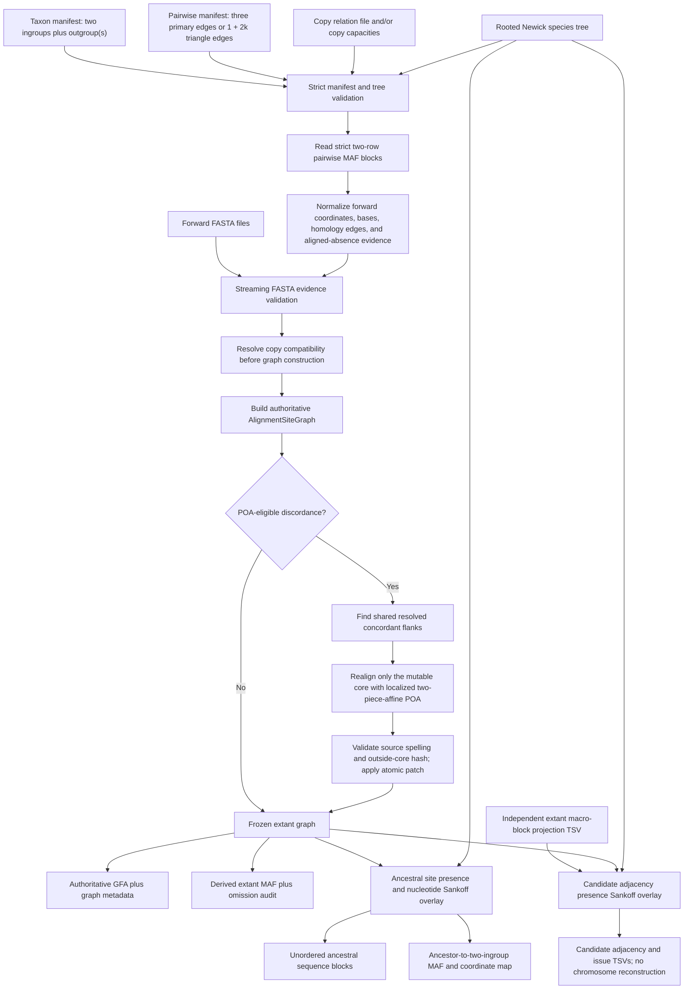
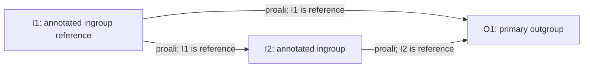
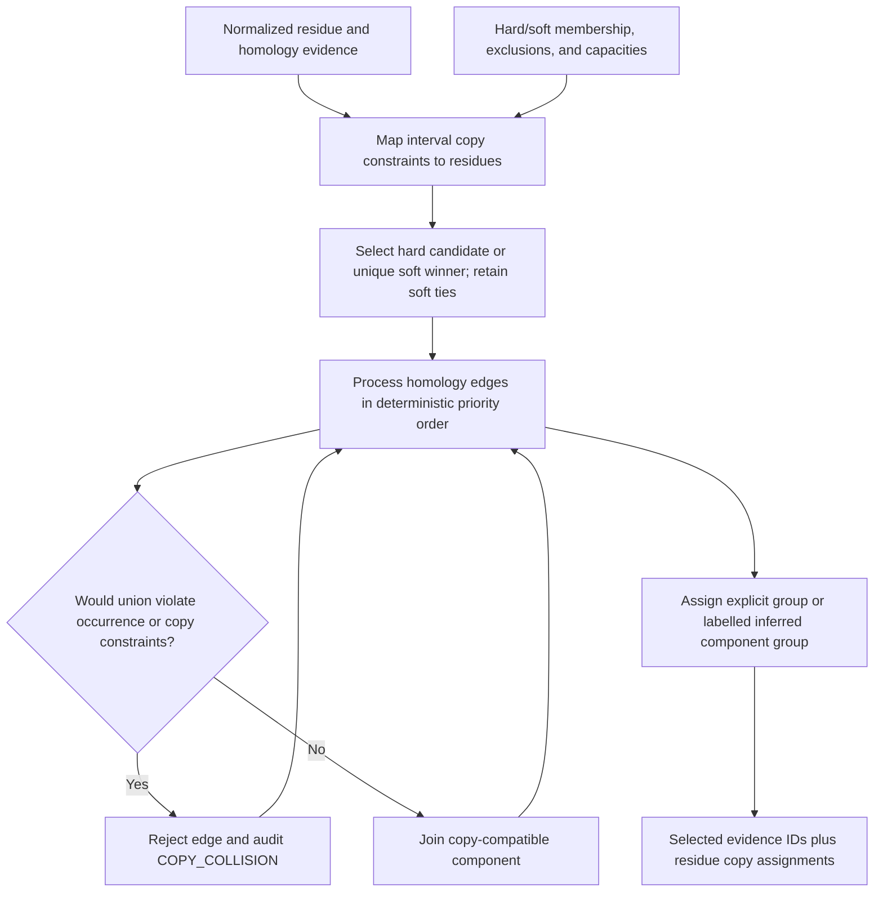
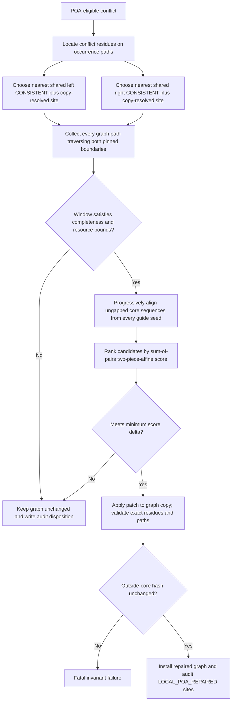
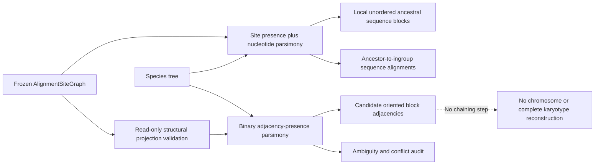

# TrioAnchorGraph with localized POA

## Implementation design, data contracts, invariants, and current limitations

This document describes the implementation currently exposed as:

```text
anchorwave trioGraphAli
```

It is an implementation document, not a proposal. Statements below distinguish
implemented behavior from future work. In particular:

- the authoritative multiple-alignment representation is an extant
  `AlignmentSiteGraph` exported as GFA plus graph metadata;
- MAF is a derived, potentially incomplete linear projection;
- ancestral base-sequence inference is a read-only overlay on the frozen graph;
- structural block-adjacency inference is a separate read-only overlay; and
- block-adjacency output contains candidate adjacencies only. It does **not**
  reconstruct ancestral chromosomes or claim a complete ancestral karyotype.

The implementation is designed around exactly two ingroup genomes and one or
more outgroups. For one primary trio, it consumes all three pairwise alignments.
With `k` outgroups, the default triangle evidence scope consumes `1 + 2k`
pairwise alignments.

## 1. Goals and non-goals

### 1.1 Implemented goals

1. Import all three pairwise alignments for the primary trio.
2. Resolve copy compatibility before graph/MSA construction.
3. Treat the graph, rather than MAF, as internal truth.
4. Detect pairwise-evidence discordance and apply localized POA only to bounded,
   eligible graph regions.
5. Use an explicit two-piece affine alignment objective for localized repair.
6. Keep alignment scores independent from evolutionary transition costs.
7. Support one primary and any number of additional outgroups.
8. Infer ancestral site presence and nucleotide state at a named internal tree
   node without modifying the extant graph.
9. Retain explicit ancestor-to-ingroup sequence alignments.
10. Infer candidate ancestral macro-block adjacencies in a separate structural
    layer with explicit block orientation and endpoints.
11. Preserve missing evidence as missing rather than silently converting it to
    a deletion.
12. Produce deterministic IDs, audit tables, and a graph core hash.

### 1.2 Explicit non-goals of the current implementation

- It is not yet a general guide-tree progressive aligner for 26 arbitrary
  ingroup genomes. A `trioGraphAli` run has exactly two ingroups; other declared
  taxa are outgroups.
- Whole-genome graph construction is not itself a traditional progressive MSA.
  It imports and reconciles pairwise homology evidence. Progressive profile
  alignment is used only inside localized discordant windows.
- Localized POA is a deterministic column/profile POA implemented with exact
  bounded dynamic programming. It is not yet a general graph-to-sequence WFA
  POA engine.
- The code does not assemble candidate block adjacencies into chromosomes,
  assign telomeres/centromeres, solve a global matching problem, or emit an
  ancestral AGP.
- Branch lengths are parsed and retained, but current Sankoff parsimony does not
  weight transition costs by branch length.
- The CLI does not currently expose evolutionary model parameters; it uses the
  default nucleotide and binary parsimony models.

## 2. End-to-end architecture



The graph core is constructed and optionally repaired before either
evolutionary overlay runs. Both overlays retain the graph core hash and validate
that they are being interpreted against the same graph.

## 3. Pairwise evidence generation

### 3.1 Primary trio

For ingroups `I1`, `I2` and primary outgroup `O1`, the workflow generates:



The arrows describe which genome drives the AnchorWave `proali` run; they do
not imply evolutionary direction. The graph importer treats each taxon pair as
an unordered evidence pair after assigning MAF row 0 and row 1 to the manifest
taxa.

Both ingroups require coordinate-matched annotations because each is used as a
`proali` reference. An outgroup is always a query in the default workflow and
may therefore be assembly-only.

### 3.2 Multiple outgroups

For outgroups `O1 ... Ok`, default `--pairwise-scope triangles` requires:

```text
I1--I2
I1--Oj  for j = 1..k
I2--Oj  for j = 1..k
```

The number of required MAFs is therefore:

```text
1 + 2k
```

The first outgroup in the workflow is assigned role `primary_outgroup`; the
remaining taxa use role `outgroup`. The primary outgroup participates in the
primary-triangle consistency labels. All outgroups represented in graph sites
can contribute to ancestral inference through the species tree.

`--pairwise-scope complete` instead requires every unordered pair among all
declared taxa, including outgroup-to-outgroup pairs. The supplied maize
workflow generates triangle scope, not complete scope.

### 3.3 Reproducible `proali` workflow

`workflow/trioanchorgraph_workflow.py` implements a plan/execute boundary:

1. prepare decompressed assemblies for every selected taxon;
2. prepare GFF3 for both ingroups;
3. run `anchorwave gff2seq` once per ingroup reference;
4. map that reference's anchor CDSs to itself and its required queries with:

   ```text
   minimap2 -x splice -k 12 -a -p 0.4 -N 20
   ```

5. reuse the reference CDS and reference SAM for each `proali` edge; and
6. emit taxon/pairwise manifests and `run_trioGraphAli.sh`.

The workflow runs pairwise tools only with `--execute`. It does not implicitly
download data and does not automatically execute the final `trioGraphAli`
command. Atomic temporary files, per-step signatures, output fingerprints,
receipts, logs, and `--resume` protect long runs from partially reused output.

`proali -R/-Q` alignment-depth limits are not graph copy constraints. Copy
identity is resolved later from the copy relation schema and pairwise evidence.

## 4. Input contracts

All coordinate-bearing TrioAnchorGraph inputs use forward, zero-based,
half-open coordinates unless the format itself specifies otherwise. MAF input
coordinates follow the MAF specification and are normalized to forward source
coordinates during import.

### 4.1 Taxon manifest

The exact TSV header is:

```text
taxon_id  role  fasta  gff  anchor_sam  anchor_fasta  callability_bed  quality_weight
```

Tabs, not spaces, delimit the actual file. Requirements are:

- exactly two taxa have role `ingroup_reference` or `ingroup` in total;
- at most one of them is `ingroup_reference`;
- exactly one taxon has role `primary_outgroup`;
- any number of additional taxa may have role `outgroup`;
- every taxon ID is unique and contains no whitespace, control character, or
  `|`;
- `fasta` is required;
- optional paths use `.`;
- relative paths are resolved relative to the manifest; and
- `quality_weight` must be finite and non-negative.

Current consumption status matters:

| Field | Current use in `trioGraphAli` |
|---|---|
| `taxon_id`, `role` | Select the two ingroups, primary outgroup, and additional outgroups. |
| `fasta` | Validate MAF source lengths and residue spelling. |
| `gff`, `anchor_sam`, `anchor_fasta` | Parsed and optionally path-validated; pairwise `proali` generation occurs in the workflow, not in `trioGraphAli`. |
| `callability_bed` | Parsed and optionally path-validated, but not yet consumed by ancestral presence inference. |
| `quality_weight` | Parsed and validated, but not yet used for graph edge weighting. |

### 4.2 Pairwise manifest

The exact header is:

```text
taxon_a  taxon_b  maf  anchor_map  score_profile  weight
```

Each unordered pair may appear once. `taxon_a` and `taxon_b` determine which
manifest taxon is assigned to MAF row 0 and row 1, respectively. `maf` and
`score_profile` are required; `anchor_map` may be `.`; `weight` must be finite
and non-negative.

Current behavior by field:

| Field | Current behavior |
|---|---|
| `maf` | Parsed into residue, homology, and aligned-absence evidence. |
| `weight` | Multiplies the MAF block `score`; the resulting score helps order copy-compatible homology edges. |
| `score_profile` | Required as provenance/configuration text, but not interpreted by the current graph command. |
| `anchor_map` | Parsed and optionally path-validated, but not consumed by current graph construction. |

### 4.3 Pairwise MAF contract

The importer accepts AnchorWave-style `a` and `s` records and, by default,
requires exactly two sequence rows per block. It validates:

- equal alignment width;
- valid non-negative source coordinates and source sizes;
- `+` or `-` strand;
- declared ungapped size equals the number of non-gap characters;
- supported DNA/IUPAC symbols; and
- no double-gap column.

For a negative-strand MAF row, both coordinate and residue spelling are
converted to forward-source form. Re-observing the same source residue with
incompatible bases or source sizes across pairwise MAFs is fatal.

Each aligned column becomes either:

- a `HomologyEvidence` edge when both rows contain a residue; or
- an `AlignedAbsenceEvidence` record when exactly one row contains a residue.

An aligned gap is accepted as explicit absence only when the absent row has an
observed residue on both sides inside the MAF block. A terminal or otherwise
unbracketed gap remains missing evidence.

### 4.4 FASTA evidence validation

FASTA validation is enabled by default. For every taxon/source referenced by
MAF evidence, the validator checks:

- source sequence ID exists exactly once;
- FASTA length equals the MAF source size;
- each observed MAF residue is IUPAC-compatible with the forward FASTA base;
- FASTA sequence symbols are valid; and
- evidence coordinates fall inside the declared source interval.

Each required FASTA is streamed once with zlib transparent reading, so plain
FASTA and gzip/BGZF-compatible sequential input are supported without retaining
whole chromosomes in memory. `--skip-fasta-validation` is available as an
explicit escape hatch, but it removes an important cross-file invariant.

### 4.5 Copy relation schema

The first non-empty line must be:

```text
#anchorwave-copy-relations-v1
```

The exact 17-column header is:

```text
record_type family_id ancestral_copy_id parent_copy_id born_on_edge taxon_id
member_type member_id seq start0 end0 strand expected_count relation confidence
constraint source
```

The three record types are:

| Record | Meaning |
|---|---|
| `GROUP` | Declares an ancestral copy identity within a family. |
| `MEMBER` | Associates or excludes a taxon occurrence with an ancestral copy. Relations are `ortholog`, `coortholog`, or `excluded`; constraints are `hard` or `soft`. |
| `COUNT` | Declares an expected copy capacity for a family and taxon. |

Implemented resolver details:

- interval members are mapped directly to source residues;
- anchor members are parsed but then rejected explicitly because
  anchor-to-interval expansion is not implemented; provide an equivalent
  `member_type=interval` constraint;
- overlapping incompatible hard assignments are fatal;
- hard exclusions are never overridden;
- soft candidates are ranked by summed confidence; ties within the resolver's
  margin remain explicit alternatives rather than being forced;
- `COUNT` records and `--copy-number TAXON=N` or `FAMILY:TAXON=N` are validation
  capacities only and never select a paralog; and
- `--copy-mode strict` requires every imported residue to have a hard explicit
  group assignment.

### 4.6 Species tree

The rooted Newick tree must contain every taxon declared in the taxon manifest.
Leaf names must be present and unique. The target supplied with
`--ancestor-node` must identify one unique named internal node.

The parser supports quoted labels, comments, whitespace, multifurcations, and
optional non-negative branch lengths. Current Sankoff inference uses topology
and the configured transition matrices; branch lengths are retained but are not
automatically multiplied into costs.

### 4.7 Independent macro-block projection schema

Structural inference is optional and requires `--block-projections`. The first
non-empty line must be:

```text
#anchorwave-block-projections-v1
```

The exact header is:

```text
projection_id taxon_id sequence block_id start0 end0 orientation source
```

Rules include:

- coordinates are non-empty, forward, zero-based, half-open intervals;
- orientation is `+`, `-`, or `?`;
- `.` in `projection_id` requests a deterministic generated ID;
- `taxon_id|sequence` must identify an occurrence path present in the extant
  graph; and
- the file must contain at least one row.

This input is a macro-synteny trust boundary. The CLI checks identifiers,
coordinates, and graph-path membership, but it does not derive block identities
from ancestral base calls and does not currently verify that a supplied macro
block interval corresponds to a particular list of graph sites. The `source`
field is required, but current inference is keyed by projection ID, taxon/path,
block ID, coordinates, and orientation.

The C++ API also provides conservative exact projection of independent
`StructuralBlockDefinition` site lists onto graph paths. The CLI currently uses
the external versioned TSV reader.

## 5. Algorithm

### 5.1 Evidence normalization

For every pairwise MAF block and alignment column:

1. assign the two rows to the manifest taxa;
2. map each non-gap character to a `ResidueId`:

   ```text
   taxon | occurrence_path | source_sequence | forward_position0
   ```

3. normalize negative-strand spelling to the forward source base;
4. create a deterministic provenance ID from run, pair, block, column, and
   residue identities;
5. create a homology edge for a residue/residue column; or
6. record present residue, absent path, and nearest absent-side flanks for a
   residue/gap column.

The complete normalized `AlignmentEvidenceSet` remains resident in memory and
contains residues, source sizes, homology edges, aligned-absence observations,
and observed taxon pairs.

### 5.2 Copy resolution before MSA/graph construction

Copy resolution is a separate pre-graph pass:



Edges with explicit endpoint information are considered before less constrained
edges; within that priority, higher weighted MAF scores precede lower scores,
then stable evidence ID breaks ties.

A candidate union is rejected when it would:

- place two different residues from one occurrence path in the same component;
- join incompatible explicit copy groups; or
- contradict a hard exclusion.

The output contains assignments, selected evidence IDs, rejected-edge audit,
and unresolved soft alternatives. Graph construction receives only selected
edges and requires residue copy assignments.

### 5.3 Authoritative alignment-site graph

Graph construction performs a second defensive disjoint-set union over selected
homology evidence. It guarantees that one alignment site cannot contain two
different residues from the same occurrence path.

Each `AlignmentSite` contains:

- a stable `siteId`;
- zero or one observed residue per occurrence path;
- resolved copy group, when present;
- direct pair-support IDs and evidence provenance;
- explicitly aligned-absent paths; and
- a consistency class.

The currently assigned primary-trio site classes are:

| Class | Current condition |
|---|---|
| `CONSISTENT` | The two ingroups and primary outgroup are observed and all three primary pairwise edges directly support the site. |
| `SUPPORTED_BY_TWO_EDGES` | All three primary taxa are observed and two primary pairwise edges directly support the site. |
| `MISSING_EVIDENCE` | Primary taxa or sufficient primary-edge support are absent. |
| `LOCAL_POA_REPAIRED` | Site was created by an accepted localized repair. |

The enum contains additional conflict labels, but current graph import directly
emits `COPY_COLLISION` and `RESIDUE_TRANSITIVITY` conflicts for the implemented
copy/transitivity checks. A residue-transitivity conflict is POA-eligible; hard
copy collisions are not.

For each extant occurrence path, residues are sorted by forward coordinate and
split into contiguous `PathSegment` objects. Each path segment stores exact
source spelling and its ordered site IDs.

### 5.4 Gap is not missing

The graph has three distinct states:

| State | Representation |
|---|---|
| Observed base | `ResidueObservation` in the site. |
| Explicit aligned absence | Occurrence path in `alignedAbsentPaths`, supported by an internally bracketed pairwise gap or accepted POA gap. |
| Missing/unknown | Neither an observation nor an aligned-absence assertion. No synthetic `-` is inserted. |

If direct gap evidence says a taxon is absent but transitive homology places a
residue from that taxon in the same site, the contradiction becomes a
POA-eligible residue-transitivity conflict rather than silently choosing one
interpretation.

### 5.5 Discordant-only localized POA

Localized repair never starts from the entire chromosome or graph component.



The mutable core excludes both pinned boundaries. Every path implicated in the
conflict must traverse both boundaries, and every other path traversing the two
boundaries is included. The engine refuses to cross a missing structural
boundary or include observations from an unrepresented path.

The current localized POA is deterministic:

1. sort input paths by ID;
2. use each path once as the initial guide seed;
3. add remaining paths to a profile in sorted order;
4. align the current profile consensus to the new sequence with exact bounded
   two-piece-affine global DP;
5. retain profile columns as POA sites with bases as allele alternatives;
6. remove all-gap columns;
7. score the resulting MSA by sum of all aligned row-pair scores; and
8. choose the highest score, breaking exact ties by canonical serialization.

This is a real localized progressive column/profile POA, but it is not a
general sequence-to-DAG aligner. Consensus-guided profile addition is a scaling
and accuracy tradeoff that should be benchmarked against a future graph-WFA
adapter.

### 5.6 Two-piece affine scoring

Scores are maximized. For a gap of length `l > 0`:

```text
g(l) = max(open1 + l * extend1,
           open2 + l * extend2)
```

Default scores are:

| Parameter | Default |
|---|---:|
| match | `2` |
| mismatch | `-4` |
| open1 | `-4` |
| extend1 | `-2` |
| open2 | `-80` |
| extend2 | `-1` |

The five DP states are match, short-gap-in-first, long-gap-in-first,
short-gap-in-second, and long-gap-in-second. The convention includes one
extension term when a gap is opened, exactly matching the formula above.

When the imported graph core has a unique complete order, it is scored as the
baseline. The patch must satisfy `new_score - old_score >= --poa-min-delta`.
If no unique complete baseline exists, the candidate is accepted after the
structural/resource/invariant checks; its delta is represented internally as
infinite because there is no comparable old MSA.

### 5.7 Patch safety

An accepted patch must:

- consume every source residue exactly once in each repaired path;
- preserve every extant residue base;
- create no all-gap alignment site;
- stay within at most one resolved copy group;
- update only path content between the pinned sites;
- satisfy all graph invariants after application; and
- leave a deterministic hash of all outside-core sites and path state
  unchanged.

Repair is applied to a copy of the input graph. Overlapping later conflicts are
not repaired twice.

## 6. Graph truth and derived MAF

### 6.1 Authoritative outputs

The authoritative pair is:

- `<prefix>.graph.gfa`
- `<prefix>.graph.meta.tsv`

Each graph site is represented by one GFA segment per observed allele. GFA paths
spell extant `PathSegment` sequences through those allele nodes. Metadata maps
site, allele node, taxon, occurrence path, source coordinate, base or aligned
absence, copy group, consistency class, and evidence IDs.

`AlignmentSiteGraph::coreHash()` covers structural site membership, extant
residue spelling, resolved copy groups, explicit gaps, and extant paths. It is a
deterministic content-change detector, not a cryptographic integrity primitive.

### 6.2 MAF export rules

`<prefix>.extant.maf` is exported only when a graph run can be linearized
without inventing information. For each connected site component, the exporter:

1. requires a unique acyclic topological order across extant path orders;
2. splits that order whenever the exact set of known paths changes;
3. requires at least two explicit paths from at least two taxa;
4. requires every row to have either an observed base or an explicit aligned
   absence at every emitted site;
5. requires observed coordinates to be forward-contiguous; and
6. refuses an all-gap row.

Missing coverage is split or omitted, never printed as `-`. Every omitted
component/run is recorded in `<prefix>.extant.maf.omissions.tsv`, including
reason and site IDs. Common omission reasons include non-unique/cyclic order,
too few explicit paths, noncontiguous coordinates, missing coverage state, and
gap-only rows without source metadata.

Consequently, the extant MAF may cover less information than the graph. Its
header embeds the authoritative graph core hash.

## 7. Alignment scoring is separate from evolutionary inference

The implementation has two independent objective families:

| Layer | Model | Purpose |
|---|---|---|
| Pairwise AnchorWave | `proali` parameters and its MAF block score | Produce pairwise anchors/alignments and order equally constrained copy-compatible evidence. |
| Local repair | Match/mismatch plus two-piece affine gap scores | Choose a localized alignment patch. |
| Nucleotide evolution | Four-state transition-cost matrix | Infer ancestral A/C/G/T state by Sankoff parsimony. |
| Presence evolution | Two-state gain/loss matrix | Infer ancestral site or adjacency presence. |

No affine gap penalty is converted into a substitution, gain, or loss cost.
No parsimony transition cost changes the extant graph or POA patch.

The current CLI uses default evolutionary costs:

- nucleotide: `0` for a match and `1` for any mismatch;
- presence: `0` for retention and `1` for either gain or loss.

The C++ models support custom directed transition matrices, including
asymmetric gain/loss costs, but those parameters are not yet CLI options.

## 8. Multiple-outgroup ancestral sequence inference

Ancestral sequence inference runs only after the extant graph is frozen.

For every graph site:

1. collect all observed leaf nucleotide states; multiple compatible states for
   one taxon become an IUPAC set;
2. create an independent presence observation for every tree leaf:
   `PRESENT` for an observed residue, `ABSENT` for explicit aligned absence,
   and `MISSING` otherwise;
3. run four-state nucleotide Sankoff inference at the named internal node;
4. run two-state presence Sankoff inference at the same node; and
5. emit a base only when copy identity is resolved, ancestral presence is
   accepted, and the configured ambiguity policy permits it.

All tree leaves, including any number of outgroups, can affect the global
minimum-cost state at the target node. Missing leaves contribute no state
constraint. Tied nucleotide optima are emitted as an IUPAC ambiguity code.
Tied presence calls are excluded by default. The binary result orders states as
absent then present and selects absent only as its deterministic API value on an
exact tie. With `--include-ambiguous-presence`, a tie containing the present
alternative is emitted and explicitly labelled
`PRESENCE_AMBIGUOUS_EMITTED`; it is never presented as a resolved presence call.

### 8.1 Ancestral sequence blocks are not chromosomes

Emitted sites are grouped using extant graph topology:

- a component with one unique topological order is split at non-emitted
  presence calls, but not at changes among per-site copy labels;
- a component without a unique order is never assigned an arbitrary sequence;
  each emitted site becomes a separate one-site block.

If every site in one sequence block has the same copy label, that label is
reported on the FASTA header. If a continuous sequence path spans multiple
per-site labels, the block-level label is `.` and the exact label for every site
remains in `ancestor.calls.tsv`. Sequence continuity therefore comes from graph
topology, while copy identity and macro-karyotype remain separate annotations.

`ancestor.blocks.fa` therefore contains local, unordered ancestral sequence
blocks. Their order in the file is stable-ID order, not an inferred chromosome
order.

## 9. Ancestor-to-child alignments

The sequence overlay retains alignment from each ancestral sequence block to
the two ingroup genomes. It does not currently export outgroup child rows.

Each block is split where the set of known ingroup occurrence paths changes.
For each ingroup path, a row is emitted only if every ancestral site has:

- a forward-contiguous observed child residue; or
- an explicit aligned absence.

Outputs are:

- `<prefix>.ancestor.children.maf`, with the ancestral row and available
  ingroup rows; and
- `<prefix>.ancestor.child-map.tsv`, with ancestor interval, child taxon/path,
  child source coordinates, state, and source site IDs.

An empty but explicit child component is represented with a MAF `e` record.
Missing coverage is not converted into such a record.

## 10. Ancestral sequence and karyotype are separate layers

The structural layer does not consume `AncestralBlock.sequence`, ancestral
nucleotide calls, or ancestral FASTA. It consumes independent extant macro-block
projections and the same immutable extant graph hash.



### 10.1 Oriented endpoints

Every structural block has canonical `HEAD` and `TAIL` ends. An extant
projection maps genomic left/right ends as follows:

| Projection orientation | Genomic left end | Genomic right end |
|---|---|---|
| `+` | `HEAD` | `TAIL` |
| `-` | `TAIL` | `HEAD` |
| `?` | unknown | unknown |

Two consecutive usable projections on one extant path create an undirected
candidate between the first block's genomic right endpoint and the second
block's genomic left endpoint, for example:

```text
B1:TAIL -- B2:HEAD
```

The candidate key is a deterministic canonical ordering of the two oriented
endpoints.

### 10.2 Conservative leaf states

For each candidate and tree leaf:

- `PRESENT`: each block has exactly one usable projection and those requested
  endpoints are adjacent;
- `ABSENT`: both blocks have exactly one usable projection, but the candidate
  endpoints are not adjacent; or
- `MISSING`: either block is absent, duplicated, overlapping, or unoriented.

Only an adjacency observed in at least one usable extant path enters the
candidate universe. The implementation does not invent never-observed block
pairs.

Binary Sankoff inference then estimates candidate presence at the named target
node. The report flags:

- `orientationConflict` when the same unordered block pair is observed with
  more than one endpoint configuration;
- `endpointConflict` when an oriented endpoint participates in more than one
  present or potentially present candidate; and
- ambiguous presence when absent and present have equal minimum cost.

`supportedWithoutLocalConflict` is true only for an unambiguously present call
without either local conflict flag.

### 10.3 No chromosome reconstruction

Every adjacency TSV row contains:

```text
inference_scope = CANDIDATE_BLOCK_ADJACENCIES_ONLY
chromosome_reconstruction = NOT_ATTEMPTED
```

This is deliberate. Even a conflict-free candidate edge is not sufficient to
claim a chromosome. A defensible future reconstruction layer would need, at
minimum, telomere/centromere evidence, global endpoint-degree optimization,
copy-aware component validation, confidence thresholds, support for unresolved
ends, chromosome-count assumptions, and explicit cycle/path handling.

## 11. Core invariants

The following invariants are enforced by code or represented explicitly in
outputs:

1. **Coordinate invariant:** all internal residue coordinates are forward,
   zero-based, and inside source bounds.
2. **Source spelling invariant:** an extant residue base must be
   IUPAC-compatible with its forward FASTA spelling unless FASTA validation is
   explicitly skipped.
3. **Residue uniqueness invariant:** one source residue appears in at most one
   graph site.
4. **Occurrence uniqueness invariant:** one graph site contains at most one
   residue from an occurrence path.
5. **Path invariant:** path-site count, sequence spelling length, and coordinate
   interval length agree.
6. **Copy-before-graph invariant:** graph union receives copy assignments and
   only copy-resolver-selected evidence.
7. **Gap/missing invariant:** only internally bracketed pairwise gaps or accepted
   POA gaps become aligned absence; unknown coverage remains missing.
8. **Localized-mutation invariant:** repair changes only the core between pinned
   concordant sites.
9. **Extant-spelling invariant:** POA may insert alignment gaps but cannot alter
   or reorder a path's source residues.
10. **Outside-core invariant:** accepted repair must preserve the outside-core
    hash exactly.
11. **Overlay invariant:** ancestral sequence and adjacency reports store the
    graph core hash and validate it before use.
12. **No-arbitrary-linearization invariant:** non-unique graph order is omitted
    from extant MAF and split into one-site ancestral sequence blocks.
13. **Determinism invariant:** stable sorting and content-derived IDs remove
    input record-order dependence from core outputs.

## 12. CLI

### 12.1 Typical strict-copy run

```bash
anchorwave trioGraphAli \
  --taxa taxa.tsv \
  --pairwise-manifest pairwise.tsv \
  --species-tree species.nwk \
  --copy-relations copy_relations.tsv \
  --copy-mode strict \
  --block-projections block_projections.tsv \
  --ancestor-node NAM_ANCESTOR \
  --output-prefix results/B73_B97_Zv
```

The parent directory of the output prefix must already exist.

### 12.2 Required options

| Option | Meaning |
|---|---|
| `--taxa FILE` | Taxon manifest. |
| `--pairwise-manifest FILE` | Pairwise MAF manifest. |
| `--species-tree FILE` | Rooted Newick species tree. |
| `--output-prefix PREFIX` | Required unless `--validate-only`. |
| `--ancestor-node NAME` | Required for ancestry output unless `--skip-ancestry` or `--validate-only`. |

### 12.3 Copy and evidence options

| Option | Default | Meaning |
|---|---:|---|
| `--copy-relations FILE` | none | Versioned GROUP/MEMBER/COUNT constraints. |
| `--copy-number SPEC` | none | Repeatable `TAXON=N` or `FAMILY:TAXON=N` validation capacity. |
| `--copy-mode constrained|strict` | `constrained` | Permit labelled inferred components or require hard explicit group for every residue. |
| `--pairwise-scope triangles|complete` | `triangles` | Required pair set. |
| `--validate-input-paths` | off | Check manifest paths early. |
| `--skip-fasta-validation` | off | Disable MAF-to-FASTA length/base checks. |

### 12.4 Repair options

| Option | Default | Meaning |
|---|---:|---|
| `--no-local-repair` | off | Classify conflict without attempting POA. |
| `--poa-min-delta FLOAT` | `0` | Minimum comparable sum-of-pairs improvement. |
| `--poa-max-core-sites N` | `10000` | Maximum distinct mutable graph sites. |
| `--poa-max-dp-cells N` | `5000000` | Maximum cells in one pairwise local DP. |
| `--poa-match FLOAT` | `2` | Match score. |
| `--poa-mismatch FLOAT` | `-4` | Mismatch score. |
| `--poa-open1 FLOAT` | `-4` | First gap-open score. |
| `--poa-extend1 FLOAT` | `-2` | First gap-extension score. |
| `--poa-open2 FLOAT` | `-80` | Second gap-open score. |
| `--poa-extend2 FLOAT` | `-1` | Second gap-extension score. |

Internal localized-POA bounds currently default to 32 sequences, 10,000 bases
per sequence, and 100,000 total bases. These three bounds are C++ API options
but are not yet exposed by the CLI.

### 12.5 Inference and control options

| Option | Meaning |
|---|---|
| `--block-projections FILE` | Enable independent candidate block-adjacency inference. |
| `--include-ambiguous-presence` | Emit a tied present/absent alternative and label it `PRESENCE_AMBIGUOUS_EMITTED`. |
| `--skip-ancestry` | Write only extant graph/projections/audits; incompatible with `--block-projections`. |
| `--validate-only` | Parse, validate, build, and optionally repair in memory, but write no output files. |
| `-h`, `--help` | Print command help. |

## 13. Output contract

### 13.1 Always written in a normal run

| Suffix | Role |
|---|---|
| `.graph.gfa` | Authoritative extant alignment graph. |
| `.graph.meta.tsv` | Authoritative site/residue/gap/copy/evidence metadata. |
| `.extant.maf` | Derived linearizable MAF projection. |
| `.extant.maf.omissions.tsv` | Runs/components not safely expressible in MAF. |
| `.copy-resolution.tsv` | Residue assignments, selected/rejected edges, soft alternatives. |
| `.discordance.tsv` | Graph conflicts and final repair dispositions. |
| `.repair-audit.tsv` | Boundaries, old/new sites, hashes, scores, and score delta. |
| `.qc.tsv` | Counts, graph hash, copy status, MAF omissions, repairs, and ancestry/adjacency totals. |

### 13.2 Written when ancestry is enabled

| Suffix | Role |
|---|---|
| `.ancestor.calls.tsv` | Per-site nucleotide and presence state sets, costs, margins, and decision. |
| `.ancestor.blocks.fa` | Local unordered ancestral sequence blocks. |
| `.ancestor.children.maf` | Ancestor-to-ingroup alignment blocks. |
| `.ancestor.child-map.tsv` | Ancestor/child coordinates and source site IDs. |

### 13.3 Written only with `--block-projections`

| Suffix | Role |
|---|---|
| `.ancestor.block-projections.tsv` | Normalized extant block occurrences. |
| `.ancestor.adjacencies.tsv` | Candidate oriented adjacency calls and leaf states. |
| `.ancestor.adjacency-issues.tsv` | Duplicate, overlap, unknown-orientation, self-adjacency, and related audits. |

The core hash is repeated in the GFA header, extant MAF header and omission
rows, ancestry/adjacency outputs, and QC. Graph metadata, copy-resolution,
discordance, and repair-audit TSVs are associated with that hash through their
shared output prefix and QC file; those TSVs do not currently repeat the core
hash in every row.

## 14. Failure modes and conservative fallbacks

### 14.1 Fatal validation failures

Examples include:

- wrong or missing exact TSV header/version;
- wrong number of ingroups or primary outgroups;
- duplicate taxon, pair, projection, or incompatible copy record;
- missing required triangle/complete pair;
- malformed MAF row, double gap, invalid coordinate, or conflicting source
  residue spelling/size;
- FASTA source missing, duplicated, wrong length, or base-incompatible;
- tree missing a manifest taxon or target internal node;
- strict copy mode without hard coverage of every residue;
- incompatible hard copy groups or include/exclude contradiction;
- anchor-member copy constraint without interval expansion; and
- graph/overlay core-hash mismatch.

### 14.2 Nonfatal graph/repair audit outcomes

A homology edge can be rejected and audited instead of aborting when it creates
a copy/occurrence collision. A POA-eligible conflict can remain unrepaired with
an audit disposition such as:

- `overlaps_previously_repaired_core`;
- `fewer_than_two_conflict_paths`;
- `conflict_spans_multiple_path_segments`;
- `no_shared_concordant_flanks`;
- `conflict_path_does_not_traverse_both_flanks`;
- `empty_mutable_core`;
- `core_too_large`;
- `core_contains_path_without_shared_flanks`; or
- `candidate_patch_below_minimum_delta`.

Some POA resource/invariant errors are fatal rather than converted into a
skipped audit, including a DP request beyond its cell limit, a local sequence
beyond internal POA bounds, crossing multiple copy groups during patch
application, source-base mutation, incomplete residue consumption, or an
outside-core hash change.

### 14.3 Nonfatal MAF omissions

Failure to linearize a graph component does not invalidate the graph. The
component is omitted from derived MAF and recorded in the omission table. This
is a central reason GFA/metadata, not MAF, are authoritative.

### 14.4 Structural ambiguity

Unknown block orientation, duplicate copies, and overlapping block projections
are represented as `MISSING` leaf evidence and issue rows. Endpoint conflicts
remain candidate calls with conflict flags. They are not resolved by arbitrary
tie-breaking and are never converted into a chromosome path.

### 14.5 Atomic output behavior

Every `trioGraphAli` output is written to `<target>.tmp` and installed with an
atomic rename after successful close. A failure can leave an older complete
target intact; the command removes its own failed temporary output.

## 15. Determinism and provenance

Deterministic behavior is based on:

- canonical unordered taxon-pair IDs;
- sorted residues, evidence edges, paths, conflicts, blocks, and calls;
- length-framed FNV-1a stable IDs for sites, conflicts, repairs, blocks, and
  projections;
- lexical tie-breaking for equal copy/POA candidates;
- graph and overlay core hashes; and
- workflow plan hashes, executable fingerprints, receipts, and source
  checksums.

Changing biological input, copy assignment, explicit gap state, repaired site
membership, or extant path order changes the core hash. Evolutionary model
changes do not mutate or re-hash the extant graph.

## 16. Test strategy

### 16.1 Current automated coverage

The C++ unit suite covers:

- taxon, pairwise, copy, and block-projection manifests;
- strict MAF parsing and negative-strand normalization;
- cross-MAF evidence normalization and source consistency;
- streamed plain/gzip FASTA validation;
- copy resolution, hard conflicts, soft alternatives, and capacities;
- graph construction, transitivity conflicts, gap-versus-missing behavior, and
  deterministic hashes;
- GFA/metadata output, conservative MAF export, and omission audit;
- exact two-piece-affine scoring and bounded DP;
- localized profile POA determinism and score acceptance;
- graph repair boundaries, source spelling, and outside-core immutability;
- Newick parsing and multi-outgroup nucleotide/binary Sankoff inference;
- ancestral sequence blocks and ancestor-to-both-ingroup projections;
- independent oriented block adjacency inference, ambiguity/conflict flags,
  deterministic TSV output, and graph immutability; and
- block projection reader path/coordinate validation.

The CLI smoke test runs the full tiny strict-copy pipeline, including FASTA
validation, graph and MAF outputs, ancestral blocks, ancestor-child MAF, and
candidate adjacency outputs. Python workflow tests use gzipped toy inputs and
fake `anchorwave`/`minimap2` executables to verify the `1 + 2k` schedule, atomic
execution, receipts, and resume invalidation.

`tests/integration/proali_trio_smoke.py` is an optional real-tool integration
test. It deterministically generates three small genomes and two annotations,
runs two real `gff2seq` jobs, five real minimap2 jobs, all three real `proali`
edges, and the final `trioGraphAli` command. It is not registered by default
because a system minimap2 executable is optional.

### 16.2 Commands

```bash
cmake -S . -B build -DANCHORWAVE_BUILD_TESTS=ON
cmake --build build --parallel
ctest --test-dir build --output-on-failure
```

The registered tests are:

```text
anchorwave_trio_unit
anchorwave_trio_cli_smoke
anchorwave_trio_workflow_unit
```

Run the optional real pairwise-tool smoke test with:

```bash
python3 tests/integration/proali_trio_smoke.py \
  --anchorwave build/anchorwave \
  --minimap2 /path/to/minimap2 \
  --work-dir /path/to/new-test-directory
```

Sanitizer validation is available for the trio library and tests:

```bash
cmake -S . -B build-asan \
  -DANCHORWAVE_BUILD_TESTS=ON \
  -DANCHORWAVE_ENABLE_SANITIZERS=ON
cmake --build build-asan --parallel
ctest --test-dir build-asan --output-on-failure
```

### 16.3 Recommended real-data validation ladder

For maize-scale use, validate progressively rather than starting with all
chromosomes and all outgroups:

1. one tiny synthetic fixture with a known graph;
2. one homologous chromosome interval from two NAM founders and one PanAnd
   outgroup;
3. one full chromosome trio;
4. one full-genome primary trio;
5. the same ingroups with several outgroups;
6. copy-rich regions with explicit interval copy constraints; and
7. replicate runs with permuted manifest row order to verify identical graph
   core hashes.

Track at minimum FASTA residues validated, copy alternatives, rejected edges,
conflict classes, POA attempts/applied repairs, outside-core hashes, MAF
omissions, ancestral ambiguity margins, and structural adjacency issues.

## 17. Scaling characteristics and caveats

### 17.1 Pairwise work

Triangle evidence grows linearly in the number of outgroups (`1 + 2k`), while
complete evidence grows quadratically in all taxa. The supplied workflow runs
its planned steps sequentially; an external scheduler is needed for safe
pair-level parallelism on a cluster.

### 17.2 Memory

FASTA validation is streamed, but normalized residues, homology edges,
aligned-absence evidence, graph sites, paths, and audit state are currently held
in memory. Base-level whole-maize alignments can therefore require substantial
RAM. The implementation does not yet shard graph construction by chromosome or
syntenic component and merge graph partitions afterward.

### 17.3 Local POA complexity

One exact pairwise DP allocates five scores/backtrace states for every matrix
cell and is bounded by `--poa-max-dp-cells`. For `s` local sequences, each of
the `s` guide seeds progressively adds roughly `s - 1` sequences, so localized
repair performs on the order of `s(s - 1)` bounded pairwise profile additions,
plus sum-of-pairs scoring. This is appropriate only because repair windows and
sequence counts are strictly bounded.

### 17.4 Graph linearization

MAF coverage can decrease as graph branching/order ambiguity increases. This is
expected behavior, not data loss from the authoritative graph. Consumers that
need all graph information must read GFA plus metadata and omission audit.

### 17.5 Additional outgroups

Additional outgroups improve polarization only where they contribute graph
observations or explicit aligned absences. The primary-trio consistency label
does not summarize support from all additional outgroups. Ancestral calls do
use all observed tree leaves.

### 17.6 Missing callability model

`callability_bed` is not yet incorporated. Current absence inference therefore
depends on explicit internally bracketed alignment gaps; everything else is
missing. A future callability layer should be versioned and must not convert
unsequenced or unaligned regions into absence.

### 17.7 Copy-model limitations

- anchor-member expansion is not implemented;
- count capacities validate declarations but do not solve copy assignment;
- inferred copy groups are evidence-component labels, not a full gene-family
  birth/death reconstruction; and
- strict mode may require interval constraints covering every imported MAF
  residue, which can be large.

### 17.8 Evolution-model limitations

Current inference is site-independent parsimony. It does not implement a
branch-length likelihood model such as JC69/HKY, context-dependent indels,
joint sequence/structure likelihood, posterior probabilities, or uncertainty
sampling. Confidence margin is a parsimony cost difference, not a calibrated
probability.

### 17.9 No 26-genome progressive orchestration yet

The MaizeGDB asset catalog and downloader cover the 26 NAM founders and selected
PanAnd `Zea` genomes, but `trioGraphAli` itself does not recursively merge
trios along a 26-tip guide tree. A future progressive controller would need a
versioned intermediate-graph contract, graph-to-graph alignment, copy identity
propagation, conflict provenance across merge levels, and tests showing that
merge order does not create unsupported homology.

### 17.10 Random-tree warning

`workflow/random_newick.py` generates a deterministic stress-test tree and
records its seed and hashes. Such a tree is suitable only for parser,
scheduler, and software stress testing. It is invalid evidence for ancestral
sequence, copy number, rearrangement, branch events, candidate ancestral
adjacencies, or ancestral karyotype.

## 18. Safe interpretation checklist

Before interpreting a run biologically, confirm that:

- all required pairwise MAFs were generated from the intended assembly and
  annotation versions;
- FASTA validation remained enabled and passed;
- the species tree is biological, rooted, and contains the named target node;
- copy constraints and capacities have biologically meaningful provenance;
- unresolved copy alternatives and rejected homology edges were reviewed;
- every applied repair preserved its outside-core hash;
- graph consumers use GFA/metadata rather than assuming MAF is complete;
- ancestor FASTA records are treated as unordered local blocks;
- ancestor-child MAF rows are distinguished from missing child coverage; and
- adjacency rows are treated as candidate oriented edges, never as reconstructed
  ancestral chromosomes.
